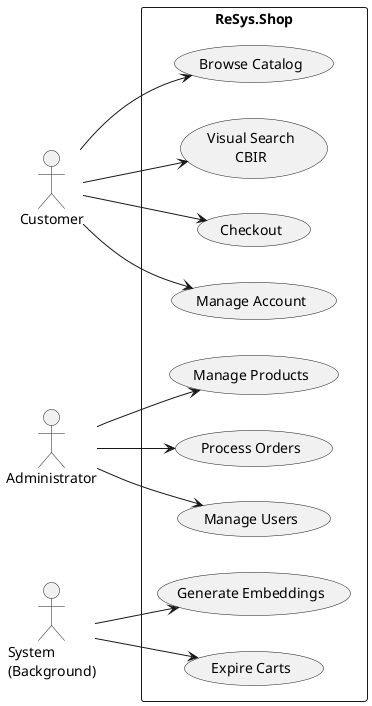
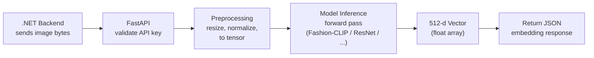

# Port Thesis v2 Implementation Plan

> **For agentic workers:** REQUIRED SUB-SKILL: Use superpowers:subagent-driven-development (recommended) or superpowers:executing-plans to implement this plan task-by-task. Steps use checkbox (`- [ ]`) syntax for tracking.

**Goal:** Rebuild the bachelor-level thesis at `thesis/` with 7-chapter CTU-compliant structure, synthesizing content from `_thesis/` and `docs/thesis/` with Mermaid/PlantUML diagrams.

**Architecture:** Single `.typ` file per chapter (7 total) in `thesis/chapters/partN/`. Diagrams as PlantUML/Mermaid sources in `diagrams/` with Makefile pipeline, output PNG to `thesis/images/diagrams/`. English only. CTU template formatting via `ctu-thesis`.

**Tech Stack:** Typst + ctu-thesis CLI, Mermaid CLI (mmdc), PlantUML (plantuml.jar), Make, IEEE BibTeX bibliography.

## Global Constraints

- Zero code snippets or code blocks in thesis text (no csharp, python, typescript, sql, shell)
- Zero file paths as content (no `Module/Catalog/...`)
- Zero "Evidence" columns in tables
- Academic prose with narrative flow between sections
- IEEE citation style via `@key` syntax
- CTU formatting: Times New Roman 13pt, 4cm left margin, 1.2 line spacing (from template)
- Table captions above tables, figure captions below figures
- Each chapter is a single `.typ` file (not a folder of sub-files)
- Build verification: `cd thesis && ctu-thesis build` must pass with zero errors
- Commit after each task with conventional commit message

---

### Task 1: Cleanup — Remove old thesis content

**Files:**
- Remove: `thesis/chapters/part1/*` and `thesis/chapters/part1/`
- Remove: `thesis/chapters/part2/*` and `thesis/chapters/part2/`
- Remove: `thesis/chapters/part3/*` and `thesis/chapters/part3/`
- Keep: `thesis/frontmatter/`, `thesis/backmatter/`, `thesis/template/`, `thesis/images/logo/`
- Keep: `thesis/info.typ`, `thesis/.ctu-thesisrc`, `thesis/compliance.json`
- Regenerate: `thesis/chapters/part1-introduction.typ` (empty include file)
- Regenerate: `thesis/chapters/part2-content.typ` (empty include file)
- Regenerate: `thesis/chapters/part3-conclusion.typ` (empty include file)

**Interfaces:**
- Consumes: Current `thesis/chapters/` directory tree
- Produces: Clean chapter directory structure ready for new content

- [ ] **Step 1: Remove old chapter directories and files**

```bash
cd /home/ngtphat/Projects/ReSys.Shop/.worktrees/feature/port-thesis
rm -rf thesis/chapters/part1 thesis/chapters/part2 thesis/chapters/part3
mkdir -p thesis/chapters/part1 thesis/chapters/part2 thesis/chapters/part3
```

- [ ] **Step 2: Regenerate include files with new structure**

Write `thesis/chapters/part1-introduction.typ`:
```typst
#include "part1/ch1-introduction.typ"
```

Write `thesis/chapters/part2-content.typ`:
```typst
#include "part2/ch2-background.typ"
#include "part2/ch3-requirements.typ"
#include "part2/ch4-architecture.typ"
#include "part2/ch5-implementation.typ"
#include "part2/ch6-evaluation.typ"
```

Write `thesis/chapters/part3-conclusion.typ`:
```typst
#include "part3/ch7-conclusion.typ"
```

- [ ] **Step 3: Verify directory structure**

```bash
cd /home/ngtphat/Projects/ReSys.Shop/.worktrees/feature/port-thesis
ls thesis/chapters/part1/ thesis/chapters/part2/ thesis/chapters/part3/
# Expected: empty directories (no .typ files yet)
ls thesis/chapters/part*-*
# Expected: part1-introduction.typ, part2-content.typ, part3-conclusion.typ
```

- [ ] **Step 4: Commit**

```bash
cd /home/ngtphat/Projects/ReSys.Shop/.worktrees/feature/port-thesis
git add thesis/chapters/
git commit -m "chore(thesis): remove old content, scaffold new chapter structure"
```

---

### Task 2: Update info.typ — English-only metadata

**Files:**
- Modify: `thesis/info.typ`
- Reference: `_thesis/info.typ` (for student data, committee, abbreviations)

**Interfaces:**
- Consumes: Current `thesis/info.typ` (has dual en/vi sections, some incorrect values)
- Produces: English-only `info.typ` with correct metadata from old thesis

- [ ] **Step 1: Read current info.typ and old `_thesis/info.typ`**

Read both files to understand current state and old thesis metadata.

- [ ] **Step 2: Rewrite info.typ**

Write `thesis/info.typ` with English-only metadata. Use student info from `_thesis/info.typ`:

```typst
#let info = (
  en: (
    student: (
      name: "Nguyen Thanh Phat",
      id: "B2005853",
      class: "DI20V7F1 (K46)",
      major: "INFORMATION TECHNOLOGY",
      program: "High-Quality Program",
    ),
    advisor: (
      name: "Dr. Tran Cong An",
    ),
    thesis: (
      title: [BUILDING A FASHION E-COMMERCE APPLICATION WITH IMAGE-BASED PRODUCT SEARCH AND MODEL BENCHMARKING],
      short_title: "FASHION E-COMMERCE WITH CBIR & MODEL BENCHMARKING",
      date: "December 2025",
      location: "Can Tho",
      degree: "BACHELOR OF ENGINEERING",
    ),
    keywords: (
      "e-commerce", "visual search", "deep learning",
      "modular architecture", "computer vision", "benchmarking",
    ),
    committee: (
      chairman: "Dr. Pham The Phi",
      reviewer: "Dr. Thai Minh Tuan",
      advisor: "Dr. Tran Cong An",
    ),
    defense_date: "December 24, 2025",
  ),
)

#let settings = (
  primary_lang: "en",
  border_color: rgb(0, 51, 153),
  format: (
    font: "Times New Roman",
    font_size: 13pt,
    margin: (
      left: 4cm,
      right: 2.5cm,
      top: 2.5cm,
      bottom: 2.5cm,
    ),
    line_spacing: 1.2,
  ),
)
```

- [ ] **Step 3: Verify no warnings from validate**

```bash
cd /home/ngtphat/Projects/ReSys.Shop/.worktrees/feature/port-thesis/thesis
ctu-thesis validate 2>&1
# Expected: all checks pass (font warning acceptable in this environment)
```

- [ ] **Step 4: Commit**

```bash
git add thesis/info.typ
git commit -m "fix(thesis): update info.typ to English-only with correct metadata"
```

---

### Task 3: Rewrite main.typ for 7-chapter structure

**Files:**
- Modify: `thesis/main.typ`
- Reference: `_thesis/main.typ` (for part-heading pattern)

**Interfaces:**
- Consumes: Updated `thesis/info.typ`, `thesis/template/`, `thesis/frontmatter/`
- Produces: Complete main.typ that renders the full 7-chapter thesis

- [ ] **Step 1: Read current main.typ and _thesis/main.typ**

Read both to understand template conventions and part-heading patterns.

- [ ] **Step 2: Rewrite main.typ**

Write `thesis/main.typ`:

```typst
#import "info.typ": *
#import "template/ctu-styles.typ": ctu-styles
#import "template/i18n.typ": term

#let lang = settings.primary_lang

#show: doc => ctu-styles(doc, lang: lang)

#set document(
  title: info.at(lang).thesis.title,
  author: info.at(lang).student.name,
)

// Front matter (Roman numerals)
#set page(numbering: "i")
#counter(page).update(1)

#import "frontmatter/cover.typ": cover-page
#import "frontmatter/inner-cover.typ": inner-cover-page
#cover-page(lang: lang)
#inner-cover-page(lang: lang)

#include "frontmatter/evaluation.typ"
#include "frontmatter/acknowledgements.typ"
#include "frontmatter/table-of-contents.typ"
#pagebreak()
#include "frontmatter/list-of-figures.typ"
#pagebreak()
#include "frontmatter/list-of-tables.typ"
#pagebreak()
#include "frontmatter/abbreviations.typ"
#include "frontmatter/abstract.typ"

// Main content (Arabic numerals)
#set page(numbering: "1")
#counter(page).update(1)
#set heading(numbering: "1.1.1")

#let part-heading(body) = {
  pagebreak()
  v(2cm)
  heading(level: 1, numbering: none, outlined: true)[#body]
}

// Part 1: Introduction
#part-heading[#term(lang, "part") 1: INTRODUCTION]
#counter(heading).update(1)
#include "chapters/part1-introduction.typ"

// Part 2: Content
#part-heading[#term(lang, "part") 2: THESIS CONTENT]
#counter(heading).step()
#include "chapters/part2-content.typ"

// Part 3: Conclusion
#part-heading[#term(lang, "part") 3: CONCLUSION AND FUTURE WORK]
#counter(heading).step()
#include "chapters/part3-conclusion.typ"

// Back matter
#pagebreak()
#include "backmatter/references.typ"
#pagebreak()
#set page(numbering: none)
#counter(heading).update(0)
#set heading(numbering: "A.1")
#include "backmatter/appendices.typ"
```

- [ ] **Step 3: Build to verify structure compiles (content will be empty — that's OK)**

```bash
cd /home/ngtphat/Projects/ReSys.Shop/.worktrees/feature/port-thesis/thesis
ctu-thesis build 2>&1
# Expected: may have warnings about empty chapters but should produce thesis-en.pdf
```

- [ ] **Step 4: Commit**

```bash
git add thesis/main.typ
git commit -m "feat(thesis): rewrite main.typ for 7-chapter structure"
```

---

### Task 4: Set up diagram infrastructure

**Files:**
- Create: `diagrams/Makefile`
- Create: `thesis/images/diagrams/.gitkeep`

**Interfaces:**
- Produces: Working diagram build pipeline, ready for source files in later tasks
- Output directory: `thesis/images/diagrams/`

- [ ] **Step 1: Create output directory**

```bash
cd /home/ngtphat/Projects/ReSys.Shop/.worktrees/feature/port-thesis
mkdir -p thesis/images/diagrams
touch thesis/images/diagrams/.gitkeep
```

- [ ] **Step 2: Verify mmdc and plantuml availability**

```bash
which mmdc 2>/dev/null && mmdc --version 2>/dev/null || echo "mmdc not available — will install via npm"
which java 2>/dev/null || echo "java not available — PlantUML requires JRE"
```

If `mmdc` not available: `npm install -g @mermaid-js/mermaid-cli`
PlantUML: download `plantuml.jar` to `diagrams/` directory.

- [ ] **Step 3: Write Makefile**

```makefile
PLANTUML = java -jar plantuml.jar
MMDC = mmdc
OUTDIR = ../thesis/images/diagrams
PLANTUML_SRC = $(wildcard *.puml)
MMD_SRC = $(wildcard *.mmd)
PLANTUML_OUT = $(patsubst %.puml,$(OUTDIR)/%.png,$(PLANTUML_SRC))
MMD_OUT = $(patsubst %.mmd,$(OUTDIR)/%.png,$(MMD_SRC))

.PHONY: all clean plantuml mermaid

all: $(OUTDIR) plantuml mermaid

$(OUTDIR):
	mkdir -p $(OUTDIR)

plantuml: $(PLANTUML_OUT)

$(OUTDIR)/%.png: %.puml
	$(PLANTUML) -tpng -output $(OUTDIR) $<

mermaid: $(MMD_OUT)

$(OUTDIR)/%.png: %.mmd
	$(MMDC) -i $< -o $@ -w 1200 -b transparent

clean:
	rm -rf $(OUTDIR)/*.png
```

- [ ] **Step 4: Commit**

```bash
git add diagrams/Makefile thesis/images/diagrams/.gitkeep
git commit -m "feat(diagrams): set up Makefile pipeline for Mermaid and PlantUML"
```

---

### Task 5: Write front matter — abbreviations and abstract

**Files:**
- Modify: `thesis/frontmatter/abbreviations.typ`
- Create: `thesis/frontmatter/abstract.typ`
- Reference: `_thesis/info.typ` abbreviations section
- Reference: Spec Section 11 (Front Matter)

**Interfaces:**
- Consumes: `_thesis/info.typ` for abbreviation definitions
- Produces: Complete abbreviations list and English abstract

- [ ] **Step 1: Write abbreviations.typ**

Read `_thesis/info.typ` abbreviations section for term definitions. Write `thesis/frontmatter/abbreviations.typ`:

Abbreviations to include:
- API — Application Programming Interface
- ANN — Approximate Nearest Neighbor
- CBIR — Content-Based Image Retrieval
- CNN — Convolutional Neural Network
- CQRS — Command Query Responsibility Segregation
- DDD — Domain-Driven Design
- DSR — Design Science Research
- EF Core — Entity Framework Core
- HNSW — Hierarchical Navigable Small World
- JWT — JSON Web Token
- mAP — Mean Average Precision
- P@K — Precision at K
- R@K — Recall at K
- REST — Representational State Transfer
- SPA — Single Page Application
- ViT — Vision Transformer
- VSA — Vertical Slice Architecture

- [ ] **Step 2: Write abstract.typ**

Write a 200-350 word abstract covering: problem (text search fails for visual fashion queries), approach (fashion e-commerce platform with CBIR, modular architecture, ML sidecar), methods (11-model benchmark across accuracy and efficiency), key findings (use placeholder values — fill with real benchmark data during Ch6 task).

- [ ] **Step 3: Build and verify**

```bash
cd /home/ngtphat/Projects/ReSys.Shop/.worktrees/feature/port-thesis/thesis
ctu-thesis build 2>&1
```

- [ ] **Step 4: Commit**

```bash
git add thesis/frontmatter/
git commit -m "feat(thesis): write abbreviations and abstract front matter"
```

---

### Task 6: Write Chapter 1 — Introduction (~6 pages)

**Files:**
- Create: `thesis/chapters/part1/ch1-introduction.typ`
- Reference: Spec Section 4 (Chapter 1)
- Reference: `_thesis/chapters/part1/01-context.typ`
- Reference: `_thesis/chapters/part1/03-objectives.typ`
- Reference: `_thesis/chapters/part1/04-research-methods.typ`

**Interfaces:**
- Consumes: `_thesis/part1/` prose, `_thesis/info.typ` metadata
- Produces: Complete Chapter 1 with sections 1.1-1.6

**Spec requirements** (from Spec Section 4):
- 1.1 Context & Motivation: Open with e-commerce growth → semantic gap problem. Keep verbatim from `_thesis/01-context.typ` lines 1-10: the digital shift, "A customer may easily recognize..." sentence.
- 1.2 Problem Statement: Four concrete problems (linguistic inconsistency, visual inexpressibility, cold start, polyglot integration). From `_thesis/01-context.typ` lines 11-16.
- 1.3 Objectives: Four technical objectives, three research questions (RQ1-RQ3), five specific tasks. From `_thesis/03-objectives.typ` lines 1-48. Update RQ1 from 3 models to "multiple embedding models spanning CNN and ViT architectures".
- 1.4 Scope & Limitations: Included scope, excluded scope, four known limitations. From `_thesis/03-objectives.typ` lines 49-75.
- 1.5 Research Methodology: DSR approach — brief (0.5 page). From `_thesis/04-research-methods.typ`.
- 1.6 Thesis Outline: 2-3 sentences per chapter summarizing all 7 chapters. New content.

**Prohibited**: No code references, no file paths, no version numbers.

- [ ] **Step 1: Read source files**

Read `_thesis/chapters/part1/01-context.typ`, `_thesis/chapters/part1/03-objectives.typ`, `_thesis/chapters/part1/04-research-methods.typ`, and Spec Section 4.

- [ ] **Step 2: Write chapter prose**

Write `thesis/chapters/part1/ch1-introduction.typ` following the spec's per-section keep/adapt/drop guidance. Each section starts with `== Section Title`. The chapter file is a single flat file with all sections inline (no sub-includes).

Key prose to keep verbatim:
- "A customer may easily recognize a specific pattern, silhouette, or texture but struggle to articulate it using standardized metadata terms like 'bohemian asymmetric maxi dress with botanical motifs.'"
- The four decomposed problems in 1.2
- The three research questions
- The "Included Scope" and "Excluded Scope" lists
- The four known limitations

- [ ] **Step 3: Build and verify**

```bash
cd /home/ngtphat/Projects/ReSys.Shop/.worktrees/feature/port-thesis/thesis
ctu-thesis build 2>&1
```

- [ ] **Step 4: Commit**

```bash
git add thesis/chapters/part1/ch1-introduction.typ
git commit -m "feat(thesis): write chapter 1 — introduction"
```

---

### Task 7: Write Chapter 2 — Background & Related Work (~7 pages)

**Files:**
- Create: `thesis/chapters/part2/ch2-background.typ`
- Reference: Spec Section 5 (Chapter 2)
- Reference: `_thesis/chapters/part2/chapter1/01-vector-embeddings.typ`
- Reference: `_thesis/chapters/part2/chapter1/02-cnn-architectures.typ` through `05-model-selection.typ`
- Reference: `_thesis/chapters/part2/chapter1/06-vector-databases.typ`
- Reference: `_thesis/chapters/part2/chapter1/09-related-work.typ`
- Reference: `_thesis/chapters/part2/chapter1/07-backend-stack.typ`, `08-frontend-stack.typ`

**Interfaces:**
- Produces: Complete Chapter 2 with sections 2.1-2.6 and Diagram 1 (CBIR pipeline)

**Spec requirements** (from Spec Section 5):
- 2.1 E-commerce Platform Architectures: New — 2 paragraphs (monolith, microservices, modular monolith; justification). 0.5 page.
- 2.2 Visual Search & CBIR: Keep verbatim from `_thesis/ch1/01-vector-embeddings.typ`. The "lists of numbers" metaphor. Cosine similarity formula. Latent space explanation. Diagram 1 (CBIR pipeline flowchart) placed here.
- 2.3 Deep Learning Models for Fashion: CNN (ResNet, EfficientNet), ViT (DINOv2), CLIP/Fashion-CLIP. Model comparison table with all benchmark models. 2.0 pages.
- 2.4 Vector Search & Databases: pgvector, HNSW, cosine distance, dual-database problem. From `_thesis/ch1/06-vector-databases.typ`.
- 2.5 Related Systems: Academic (DeepFashion, FashionIQ, CLIP) + Commercial (Google Lens, Pinterest, ASOS, ViSenze) + four contribution differentiators. Keep verbatim from `_thesis/ch1/09-related-work.typ`.
- 2.6 Technology Stack: Table (Vue/.NET/Python/PostgreSQL/Redis/Aspire/Hangfire/JWT) with 1-2 sentence rationale per row.

**Diagram 1 specification**: CBIR Pipeline Overview (Mermaid flowchart). Create `diagrams/01-cbir-pipeline.mmd`:

Run `make` in diagrams/ to generate PNG. Reference in thesis as `#figure(image("images/diagrams/01-cbir-pipeline.png", width: 90%), caption: [...])`.

- [ ] **Step 1: Read source files**

Read all `_thesis/chapter1/` files and Spec Section 5.

- [ ] **Step 2: Create Diagram 1 source and generate**

```bash
cd /home/ngtphat/Projects/ReSys.Shop/.worktrees/feature/port-thesis/diagrams
# Write 01-cbir-pipeline.mmd (content above)
make mermaid
ls ../thesis/images/diagrams/01-cbir-pipeline.png
```

- [ ] **Step 3: Write chapter prose**

Write `thesis/chapters/part2/ch2-background.typ`. Follow spec's keep/adapt/drop for each section.

Critical elements:
- 2.2: Cosine formula in Typst math: `$ "similarity" = cos(theta) = (A dot B) / (||A|| times ||B||) $`
- 2.3.4: Model comparison table with real benchmark model names and approximate inference times
- 2.5: The four contribution differentiators — update "microservices mesh" to "modular monolith with ML sidecar"
- 2.6: Technology stack table — 8 rows, no version numbers

- [ ] **Step 4: Build and verify**

```bash
cd /home/ngtphat/Projects/ReSys.Shop/.worktrees/feature/port-thesis/thesis
ctu-thesis build 2>&1
```

- [ ] **Step 5: Commit**

```bash
git add thesis/chapters/part2/ch2-background.typ diagrams/01-cbir-pipeline.mmd thesis/images/diagrams/01-cbir-pipeline.png
git commit -m "feat(thesis): write chapter 2 — background and related work"
```

---

### Task 8: Write Chapter 3 — Requirements Analysis (~6 pages)

**Files:**
- Create: `thesis/chapters/part2/ch3-requirements.typ`
- Reference: Spec Section 6 (Chapter 3)
- Reference: `_thesis/chapters/part2/chapter2/02-functional-requirements.typ`
- Reference: `_thesis/chapters/part2/chapter2/03-use-cases.typ`
- Reference: `_thesis/chapters/part2/chapter2/use-cases/customer/uc-0004-visual-search.typ`
- Reference: `_thesis/chapters/part2/chapter2/use-cases/customer/uc-0002-checkout.typ`

**Interfaces:**
- Produces: Complete Chapter 3 with sections 3.1-3.5 and Diagram 2 (use case)

**Spec requirements** (from Spec Section 6):
- 3.1 System Actors: Customer, Administrator, System — table format. 0.5 page.
- 3.2 Functional Requirements: Prose per module (Catalog, Ordering, Payment, Inventory, Identity, Profile, Shipping, Location). No FR-XX IDs. Summary table at end. 2.0 pages.
- 3.3 Non-Functional Requirements: Performance, security, modularity, observability, reliability. Table with targets. 1.0 page.
- 3.4 Use Cases: Three use cases — Visual Search (CBIR), Checkout, Model Benchmark Evaluation. Compact table format. Diagram 2 (use case diagram). 1.0 page.
- 3.5 Feature Classification: Core Research vs Supporting Infrastructure table. 0.5 page.

**Diagram 2 specification**: Use Case Diagram (PlantUML). Create `diagrams/02-use-case.puml`:



- [ ] **Step 1: Read source files**

Read `_thesis/chapter2/02-functional-requirements.typ` and `03-use-cases.typ`, Spec Section 6.

- [ ] **Step 2: Create Diagram 2 source and generate**

```bash
cd /home/ngtphat/Projects/ReSys.Shop/.worktrees/feature/port-thesis/diagrams
# Write 02-use-case.puml (content above)
make plantuml
ls ../thesis/images/diagrams/02-use-case.png
```

- [ ] **Step 3: Write chapter prose**

Write `thesis/chapters/part2/ch3-requirements.typ`.

Critical elements:
- 3.2: Each module gets 3-5 sentences of prose, no bullet lists, no FR-XX codes
- 3.2: Summary table at end with columns [Module, Key Responsibilities, Research Classification]
- 3.3: NFR table with concrete targets ("< 1 second", "15-minute expiry")
- 3.4: Three use cases only. Each as compact table (actor, precondition, numbered flow steps, postcondition)
- 3.5: Core Research vs Supporting table — 7 rows

- [ ] **Step 4: Build and verify**

```bash
cd /home/ngtphat/Projects/ReSys.Shop/.worktrees/feature/port-thesis/thesis
ctu-thesis build 2>&1
```

- [ ] **Step 5: Commit**

```bash
git add thesis/chapters/part2/ch3-requirements.typ diagrams/02-use-case.puml thesis/images/diagrams/02-use-case.png
git commit -m "feat(thesis): write chapter 3 — requirements analysis"
```

---

### Task 9: Write Chapter 4 — System Architecture & Design (~12 pages)

**Files:**
- Create: `thesis/chapters/part2/ch4-architecture.typ`
- Reference: Spec Section 7 (Chapter 4)
- Reference: `_thesis/chapters/part2/chapter2/01-system-overview.typ`
- Reference: `_thesis/chapters/part2/chapter2/04-architecture.typ`
- Reference: `_thesis/chapters/part2/chapter2/05-database-design.typ`
- Reference: `_thesis/chapters/part2/chapter2/06-api-design.typ`
- Reference: `_thesis/chapters/part2/chapter2/database/01-identity.typ` through `04-inventory.typ`
- Reference: `_thesis/chapters/part2/chapter2/architecture/07-ddd.typ`, `08-cross-context-patterns.typ`

**Interfaces:**
- Produces: Complete Chapter 4 with sections 4.1-4.6 and Diagrams 3-10

**Spec requirements** (from Spec Section 7):
- 4.1 System Overview: Three-service architecture table. Bounded contexts overview. 1.0 page.
- 4.2 Domain-Driven Design: Bounded context map (Diagram 6), aggregates and invariants (Product, Order, PaymentIntent, StockItem), state machines (Diagrams 8, 9). 2.5 pages.
- 4.3 C4 Architecture: Context (Diagram 3), Container (Diagram 4), Component (Diagram 5). Deployment (Diagram 10). 2.0 pages.
- 4.4 Database Design: ERD (Diagram 7), pgvector integration, schema organization, key design decisions, per-context schemas. 2.0 pages.
- 4.5 API Design: Carter minimal APIs, MediatR CQRS, endpoint organization, key endpoints table. 1.5 pages.
- 4.6 Security Design: JWT auth flow, authorization model, security measures (rate limiting, headers, file validation, webhook sig). 1.5 pages.

**Diagrams for this chapter** (8 diagrams):

Diagram 3 (C4 Context): Create `diagrams/03-c4-context.puml` — System box "ReSys.Shop" with Customer, Admin, Stripe, SendGrid, Python ML actors. Convert from `docs/thesis/diagrams/c4-context.mmd`.

Diagram 4 (C4 Container): Create `diagrams/04-c4-container.puml` — Vue SPA, .NET API, Python ML, PostgreSQL, Redis, Hangfire containers with communication arrows. Convert from `docs/thesis/diagrams/c4-container.mmd`.

Diagram 5 (C4 Component): Create `diagrams/05-c4-component.puml` — 8 business modules inside .NET API connected via MediatR bus. Convert from `docs/thesis/diagrams/c4-component.mmd`.

Diagram 6 (Bounded Context Map): Create `diagrams/06-bounded-context-map.puml` — 8 contexts with Published Language flows. Convert from `docs/thesis/diagrams/bounded-context-map.mmd`.

Diagram 7 (ERD): Create `diagrams/07-erd-core.mmd` — Core entities and relationships. Convert from `docs/thesis/diagrams/erd-core.mmd`.

Diagram 8 (Order State Machine): Create `diagrams/08-order-state-machine.puml` — States: Address → Delivery → Payment → Confirm → Complete, with Cancel from any. Convert from `docs/thesis/diagrams/state-order.mmd`.

Diagram 9 (Payment State Machine): Create `diagrams/09-payment-state-machine.puml` — Pending → RequiresAction → Processing → Succeeded/Canceled/Failed, with Capture → Refunded/Voided. Convert from `docs/thesis/diagrams/state-payment.mmd`.

Diagram 10 (Deployment): Create `diagrams/10-deployment.puml` — Docker host, containers, Aspire boundary, network zones. Convert from `docs/thesis/diagrams/deployment.mmd`.

- [ ] **Step 1: Read source files and existing Mermaid diagram sources**

Read all `_thesis/chapter2/` architecture and database files. Read `docs/thesis/diagrams/c4-*.mmd`, `erd-core.mmd`, `state-*.mmd`, `deployment.mmd`, `bounded-context-map.mmd`. Read Spec Section 7.

- [ ] **Step 2: Create all 8 diagram sources and generate**

```bash
cd /home/ngtphat/Projects/ReSys.Shop/.worktrees/feature/port-thesis/diagrams
# For each Mermaid source from docs/thesis/diagrams/, read it and convert to PlantUML (.puml) if it's structural (C4, state, deployment, context map)
# Keep Mermaid (.mmd) for ERD
# Write all 8 source files
make all
ls ../thesis/images/diagrams/
# Expected: 03-*.png through 10-*.png
```

For PlantUML conversions from Mermaid:
- C4 diagrams: Use PlantUML C4 library (`!include <C4/C4_Context>`, `!include <C4/C4_Container>`, `!include <C4/C4_Component>`)
- State machines: Use PlantUML state diagram syntax (`[*] --> State1`, etc.)
- Bounded context map: Use PlantUML component diagram with nodes and arrows
- Deployment: Use PlantUML deployment diagram syntax (`node`, `database`, etc.)

- [ ] **Step 3: Write chapter prose**

Write `thesis/chapters/part2/ch4-architecture.typ`. This is the largest chapter — allocate time accordingly.

Critical elements:
- 4.2: Ubiquitous language glossary — one of the strongest academic elements. Include as compact table.
- 4.2.3: State machine prose for both order checkout and payment intent. Reference Diagrams 8 and 9.
- 4.3: One paragraph of prose per C4 diagram, not just captions.
- 4.4: pgvector query described conceptually ("cosine distance operator on 512-d vectors"), not as SQL.
- 4.4.3: Key design decisions paragraph — GUIDs, soft deletes, audit columns, composite indexes, variable vector dimensions.
- 4.5: API design philosophy, not endpoint catalog. 6 key endpoints in summary table.
- 4.6: Token flow described in prose. No JWT payload examples.

- [ ] **Step 4: Build and verify**

```bash
cd /home/ngtphat/Projects/ReSys.Shop/.worktrees/feature/port-thesis/thesis
ctu-thesis build 2>&1
```

- [ ] **Step 5: Commit**

```bash
git add thesis/chapters/part2/ch4-architecture.typ diagrams/03-*.puml diagrams/04-*.puml diagrams/05-*.puml diagrams/06-*.puml diagrams/07-*.mmd diagrams/08-*.puml diagrams/09-*.puml diagrams/10-*.puml thesis/images/diagrams/
git commit -m "feat(thesis): write chapter 4 — system architecture and design"
```

---

### Task 10: Write Chapter 5 — Implementation (~7 pages)

**Files:**
- Create: `thesis/chapters/part2/ch5-implementation.typ`
- Reference: Spec Section 8 (Chapter 5)
- Reference: `_thesis/chapters/part2/chapter2/07-implementation.typ`
- Reference: `_thesis/chapters/part2/chapter2/implementation/01-ml-service.typ` (all sub-files)
- Reference: `_thesis/chapters/part2/chapter2/implementation/02-backend/04-product-images-vectorization.typ`

**Interfaces:**
- Produces: Complete Chapter 5 with sections 5.1-5.5 and Diagrams 11, 12
- References: Architecture components described in Ch4

**Spec requirements** (from Spec Section 8):
- 5.1 Vertical Slice Architecture: Brief — 0.5 page. Pattern concept, no code.
- 5.2 ML Embedding Pipeline: Three-layer design (FastAPI → ModelManager → PyTorch). Lazy loading. Embedding generation flow. Diagram 11. 2.0 pages.
- 5.3 CBIR Search Flow: Full end-to-end flow described in prose + Diagram 12 (sequence). 1.5 pages.
- 5.4 Model Configuration: EMBEDDING_MODEL env var, model_name metadata, A/B testing enabler. 0.5 page.
- 5.5 E-commerce Core: Catalog, Ordering, Payment, Inventory, Background Automation — one paragraph each. 1.5 pages.

**Diagram 11 specification**: ML Embedding Pipeline (Mermaid). Create `diagrams/11-ml-pipeline.mmd`:


**Diagram 12 specification**: CBIR Search Sequence (PlantUML). Create `diagrams/12-cbir-search-sequence.puml`:
Full sequence as specified in Spec Section 8.3 — Customer → Vue SPA → .NET API → Python ML Sidecar → PostgreSQL pgvector → response. Include activation on ML sidecar.

- [ ] **Step 1: Read source files**

Read `_thesis/chapter2/implementation/` files (ML, Backend sections). Read Spec Section 8.

- [ ] **Step 2: Create Diagrams 11 and 12, generate**

```bash
cd /home/ngtphat/Projects/ReSys.Shop/.worktrees/feature/port-thesis/diagrams
# Write 11-ml-pipeline.mmd and 12-cbir-search-sequence.puml
make all
ls ../thesis/images/diagrams/11-ml-pipeline.png ../thesis/images/diagrams/12-cbir-search-sequence.png
```

- [ ] **Step 3: Write chapter prose**

Write `thesis/chapters/part2/ch5-implementation.typ`.

Critical elements:
- 5.2: The three-layer architecture from `_thesis` (FastAPI API → ModelManager → PyTorch) — keep this structure, it's well-explained.
- 5.2.3: Numbered steps for embedding generation flow (1-7).
- 5.3: Describe the full flow conceptually (not as code). Mention HNSW index, model_name filter, minimum similarity threshold.
- 5.4: This is a key enabler for Ch6 — make sure the connection is clear.
- 5.5: Keep brief. No module gets more than 5 sentences. No admin panel UI description.

- [ ] **Step 4: Build and verify**

```bash
cd /home/ngtphat/Projects/ReSys.Shop/.worktrees/feature/port-thesis/thesis
ctu-thesis build 2>&1
```

- [ ] **Step 5: Commit**

```bash
git add thesis/chapters/part2/ch5-implementation.typ diagrams/11-ml-pipeline.mmd diagrams/12-cbir-search-sequence.puml thesis/images/diagrams/11-*.png thesis/images/diagrams/12-*.png
git commit -m "feat(thesis): write chapter 5 — implementation"
```

---

### Task 11: Write Chapter 6 — Testing & Evaluation (~7 pages)

**Files:**
- Create: `thesis/chapters/part2/ch6-evaluation.typ`
- Reference: Spec Section 9 (Chapter 6)
- Reference: `_thesis/chapters/part2/chapter3/01-objectives.typ`
- Reference: `_thesis/chapters/part2/chapter3/02-methodology.typ`
- Reference: `_thesis/chapters/part2/chapter3/04-results.typ`
- Reference: `_thesis/chapters/part2/chapter3/05-discussion.typ`
- Reference: `_thesis/chapters/part2/chapter3/testing/goal.typ`
- Reference: `_thesis/chapters/part2/chapter3/testing/accuracy.typ`
- Reference: `_thesis/chapters/part2/chapter3/results/02-ml-accuracy.typ`
- Reference: `_thesis/chapters/part2/chapter3/results/04-performance-metrics.typ`
- Data: `benchmarks/outputs/thesis/tables/thesis_aggregate.typ`
- Data: `benchmarks/outputs/thesis/tables/thesis_efficiency.typ`

**Interfaces:**
- Consumes: Benchmark data files (authoritative numbers)
- Produces: Complete Chapter 6 with sections 6.1-6.5 and Tables 13, 14, 15

**Spec requirements** (from Spec Section 9):
- 6.1 Testing Strategy: Three levels — unit, integration, E2E. Brief (1 page).
- 6.2 Benchmark Protocol: Dataset, models evaluated, metrics definitions, methodology steps, hardware environment. 1.5 pages.
- 6.3 Retrieval Performance: Table 13 (aggregate metrics) from `thesis_aggregate.typ`. Prose analysis interpreting results. Answer RQ1. 1.5 pages.
- 6.4 Efficiency Metrics: Table 14 (efficiency) from `thesis_efficiency.typ`. Prose analysis. Answer RQ2. 1.0 page.
- 6.5 Model Comparison & Discussion: Accuracy-efficiency trade-off, deployment recommendations, limitations, lessons learned. Answer RQ3. 1.5 pages.

**Data handling**: Read the actual benchmark data files. Do NOT fabricate numbers. If `thesis_aggregate.typ` has P@20/R@20 zero values for some models, include them and explain in the discussion section.

- [ ] **Step 1: Read source files and benchmark data**

Read all `_thesis/chapter3/` files. Read `benchmarks/outputs/thesis/tables/thesis_aggregate.typ` and `thesis_efficiency.typ`. Read Spec Section 9.

- [ ] **Step 2: Write chapter prose**

Write `thesis/chapters/part2/ch6-evaluation.typ`.

Critical elements:
- 6.2.2: Model comparison table grouping 11 models by architecture type (CNN, ViT, CLIP-based, Fashion-specific).
- 6.2.3: Define each metric (mAP, P@K, R@K, inference time, throughput, storage, RAM) before they appear in any table.
- 6.3: Table 13 embedded directly in Typst (or included from `thesis_aggregate.typ`). Sort by mAP descending. Bold best values.
- 6.3: Prose MUST interpret, not read the table. "Fashion-CLIP achieves X.XX mAP, which is Y% higher than the next best model..."
- 6.4: Table 14 similarly. Discuss the accuracy-efficiency trade-off explicitly.
- 6.5.1: Accuracy-efficiency scatter concept described in prose (not necessarily a rendered chart — Typst table comparison is sufficient).
- 6.5.2: Deployment recommendations per use case (production GPU, CPU-only, max accuracy, mobile/edge).
- 6.5.3: Acknowledge P@20/R@20 zero values if present. Explain: embedding quality, dataset mismatch, category granularity.
- 6.5.4: Lessons learned bullet list.

- [ ] **Step 3: Build and verify**

```bash
cd /home/ngtphat/Projects/ReSys.Shop/.worktrees/feature/port-thesis/thesis
ctu-thesis build 2>&1
```

- [ ] **Step 4: Commit**

```bash
git add thesis/chapters/part2/ch6-evaluation.typ
git commit -m "feat(thesis): write chapter 6 — testing and evaluation"
```

---

### Task 12: Write Chapter 7 — Conclusion & Future Work (~4 pages)

**Files:**
- Create: `thesis/chapters/part3/ch7-conclusion.typ`
- Reference: Spec Section 10 (Chapter 7)
- Reference: `_thesis/chapters/part3/01-conclusion.typ`
- Reference: `_thesis/chapters/part3/02-future-work.typ`
- Reference: `docs/thesis/12-requirements-traceability-matrix.md` (selective — simplified matrix)

**Interfaces:**
- Consumes: Ch1 RQs, Ch6 benchmark results, Ch4-5 architecture and implementation
- Produces: Complete Chapter 7 with sections 7.1-7.5

**Spec requirements** (from Spec Section 10):
- 7.1 Summary of Work: 3-4 paragraphs — what was built, evaluated, found. Answer RQ1, RQ2, RQ3 explicitly with numbers. 1.0 page.
- 7.2 Contributions: 5 bullet points with concrete claims. 0.5 page.
- 7.3 Limitations: 7 honest limitations. 0.5 page.
- 7.4 Future Work: 7 actionable, prioritized items. 0.5 page.
- 7.5 Requirements Traceability: Compact table mapping Ch1 objectives → Ch4-Ch6 addressed → Key finding. 0.5 page.

- [ ] **Step 1: Read source files**

Read `_thesis/part3/` files and `docs/thesis/12-requirements-traceability-matrix.md`. Read Spec Section 10.

- [ ] **Step 2: Write chapter prose**

Write `thesis/chapters/part3/ch7-conclusion.typ`.

Critical elements:
- 7.1: Answer ALL THREE research questions explicitly. Use actual numbers from Ch6. Format: "RQ1: Fashion-CLIP outperformed general-purpose models by X%..."
- 7.2: Contributions are specific and verifiable. "11-model benchmark" not "comprehensive evaluation".
- 7.3: Limitations are honest. Include P@20/R@20 zero values explanation if relevant.
- 7.4: Future work is actionable and prioritized (#1 is most important/feasible).
- 7.5: Traceability table: 5 rows (4 objectives + 3 RQs = min 7 rows). Each row confirms a Ch1 → ChN connection.
- Conclusion must NOT introduce new information not covered in earlier chapters.

- [ ] **Step 3: Build and verify**

```bash
cd /home/ngtphat/Projects/ReSys.Shop/.worktrees/feature/port-thesis/thesis
ctu-thesis build 2>&1
```

- [ ] **Step 4: Commit**

```bash
git add thesis/chapters/part3/ch7-conclusion.typ
git commit -m "feat(thesis): write chapter 7 — conclusion and future work"
```

---

### Task 13: Write back matter — bibliography and appendices

**Files:**
- Modify: `thesis/backmatter/bibliography.bib` (expand to 20+ entries)
- Modify: `thesis/backmatter/appendices.typ` (benchmark raw data)
- Reference: Current `thesis/backmatter/bibliography.bib` (16 entries)
- Reference: `benchmarks/docs/07-references.md` (additional references)

**Interfaces:**
- Consumes: Existing bib entries, benchmark data
- Produces: IEEE bibliography (20+ entries), appendices with benchmark data tables

- [ ] **Step 1: Read current bibliography and references source**

Read `thesis/backmatter/bibliography.bib` and `benchmarks/docs/07-references.md`.

- [ ] **Step 2: Add missing entries to bibliography.bib**

Add BibTeX entries for any references cited in the thesis chapters that are missing. Minimum 20 total entries. Key references needed:
- @liu2016deepfashion — DeepFashion dataset
- @chia2022fashionclip — Fashion-CLIP paper
- CLIP paper (Radford et al., 2021)
- DINOv2 paper (Oquab et al., 2023)
- ResNet paper (He et al., 2016)
- EfficientNet paper (Tan & Le, 2019)
- pgvector documentation/reference
- IEEE formatting: use `@article`, `@inproceedings`, `@misc` as appropriate

- [ ] **Step 3: Write appendices.typ**

Write `thesis/backmatter/appendices.typ`:
- Appendix A: Full benchmark results table (all 11 models, all metrics, mean ± SD)
- Appendix B: Dataset composition (number of query images, category distribution, image sources)
- Appendix C: Hardware specifications for benchmark environment (GPU, CPU, RAM, OS)

Include data from `benchmarks/outputs/thesis/`.

- [ ] **Step 4: Build and verify**

```bash
cd /home/ngtphat/Projects/ReSys.Shop/.worktrees/feature/port-thesis/thesis
ctu-thesis build 2>&1
# Check: bibliography renders correctly, no missing citation warnings
```

- [ ] **Step 5: Commit**

```bash
git add thesis/backmatter/
git commit -m "feat(thesis): expand bibliography and write appendices"
```

---

### Task 14: Full build verification and cleanup

**Files:**
- No new files. Verify all existing files compile cleanly.
- Run `ctu-thesis validate` for compliance check.

**Interfaces:**
- Consumes: All thesis content (chapters, front matter, back matter, diagrams)
- Produces: Clean build with zero errors, validation report

- [ ] **Step 1: Full build**

```bash
cd /home/ngtphat/Projects/ReSys.Shop/.worktrees/feature/port-thesis/thesis
ctu-thesis build 2>&1
# Expected: Generated thesis-en.pdf with zero errors
```

- [ ] **Step 2: Validate compliance**

```bash
ctu-thesis validate 2>&1
# Expected: All checks passed. Font warning for Times New Roman acceptable in this environment.
```

- [ ] **Step 3: Check for warnings and fix**

Review the build output. For each warning:
- Fix missing citations
- Fix broken cross-references
- Fix oversize images
- Font warnings (Times New Roman) — acceptable, note in compliance report

- [ ] **Step 4: Rebuild after fixes**

```bash
ctu-thesis build 2>&1
# Target: zero errors, zero warnings (except font if unavoidable)
```

- [ ] **Step 5: Audit for prohibited content**

Scan all `.typ` files in `thesis/chapters/` for violations:
- No code snippets (`#![csharp...]` blocks) → fix if found
- No file paths as content (`Module/Catalog/...`) → fix if found
- No "Evidence" columns → fix if found
- No CLI commands → fix if found
- No git references → fix if found
- No markdown artifacts → fix if found

```bash
cd /home/ngtphat/Projects/ReSys.Shop/.worktrees/feature/port-thesis/thesis/chapters
rg "`Module/" --include="*.typ" && echo "VIOLATION: file path found" || echo "OK: no file paths"
rg '```' --include="*.typ" && echo "VIOLATION: code fence found" || echo "OK: no code fences"
rg "Evidence" --include="*.typ" && echo "VIOLATION: evidence column found" || echo "OK: no evidence columns"
rg "commit [0-9a-f]" --include="*.typ" && echo "VIOLATION: git reference found" || echo "OK: no git references"
```

- [ ] **Step 6: Final commit**

```bash
git add thesis/
git commit -m "chore(thesis): final build verification and content audit"
```

---

### Task 15: Generate all diagrams via Makefile

**Files:**
- Create/verify all diagram source files exist in `diagrams/`
- Generate all PNG outputs to `thesis/images/diagrams/`

**Full diagram inventory**:

| # | Source | Tool | Status |
|---|---|---|---|
| 1 | `diagrams/01-cbir-pipeline.mmd` | Mermaid | Created in Task 7 |
| 2 | `diagrams/02-use-case.puml` | PlantUML | Created in Task 8 |
| 3 | `diagrams/03-c4-context.puml` | PlantUML | Created in Task 9 |
| 4 | `diagrams/04-c4-container.puml` | PlantUML | Created in Task 9 |
| 5 | `diagrams/05-c4-component.puml` | PlantUML | Created in Task 9 |
| 6 | `diagrams/06-bounded-context-map.puml` | PlantUML | Created in Task 9 |
| 7 | `diagrams/07-erd-core.mmd` | Mermaid | Created in Task 9 |
| 8 | `diagrams/08-order-state-machine.puml` | PlantUML | Created in Task 9 |
| 9 | `diagrams/09-payment-state-machine.puml` | PlantUML | Created in Task 9 |
| 10 | `diagrams/10-deployment.puml` | PlantUML | Created in Task 9 |
| 11 | `diagrams/11-ml-pipeline.mmd` | Mermaid | Created in Task 10 |
| 12 | `diagrams/12-cbir-search-sequence.puml` | PlantUML | Created in Task 10 |

Tables 13-15 are Typst-native (embedded in Ch6), not generated via Makefile.

- [ ] **Step 1: Verify all source files exist**

```bash
cd /home/ngtphat/Projects/ReSys.Shop/.worktrees/feature/port-thesis/diagrams
ls -1 *.mmd *.puml 2>/dev/null | wc -l
# Expected: 12 (all source files)
```

- [ ] **Step 2: Clean and regenerate all diagrams**

```bash
make clean
make all
ls -1 ../thesis/images/diagrams/*.png 2>/dev/null | wc -l
# Expected: 12 PNG files
```

- [ ] **Step 3: Rebuild thesis with all diagrams**

```bash
cd /home/ngtphat/Projects/ReSys.Shop/.worktrees/feature/port-thesis/thesis
ctu-thesis build 2>&1
# Expected: Generated thesis-en.pdf, all diagrams embedded correctly
```

- [ ] **Step 4: Commit**

```bash
git add diagrams/*.mmd diagrams/*.puml thesis/images/diagrams/*.png
git commit -m "feat(diagrams): add all 12 diagram sources and generated PNGs"
```
