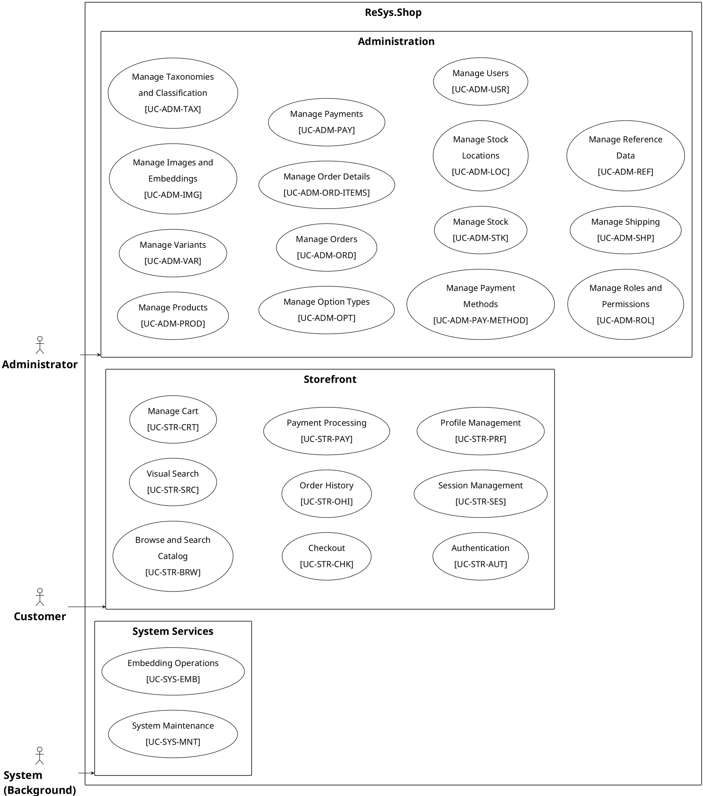

# Use Case Diagram Style and Layout Fixes — Implementation Plan

> **For agentic workers:** REQUIRED SUB-SKILL: Use superpowers:subagent-driven-development (recommended) or superpowers:executing-plans to implement this plan task-by-task. Steps use checkbox (`- [ ]`) syntax for tracking.

**Goal:** Fix PlantUML warnings in shared style, unwedge the overview diagram layout, and reorder diagram-before-table in all .typ files.

**Architecture:** Three independent fixes: (1) remove skinparam/layout from shared styles, add per-file; (2) flatten overview by removing 25 topic rectangles; (3) swap image block above UC heading in 25 .typ files.

**Tech Stack:** PlantUML, sed/grep, Make, typst

## Global Constraints

- All paths relative to `thesis/` directory at `/home/ngtphat/Projects/ReSys.Shop/.worktrees/feature/port-thesis/thesis/`
- `_shared/styles.iuml` must contain ONLY `<style>...</style>` block — no skinparam, no `left to right direction`
- Each per-topic `.puml` declares `left to right direction`, `skinparam padding 8`, `skinparam nodesep 40`, `skinparam ranksep 40` BEFORE `!include _shared/styles.iuml`
- Overview uses `skinparam` (not `<style>`) for page-width readability
- Overview must NOT use nested topic rectangles — UC ellipses directly inside 3 area rectangles
- `.typ` files: `#figure(image(...))` before `==== UC-` heading, after `// Diagram placeholder:` comment
- Do NOT modify `.puml` content beyond layout directives — UC logic, <<include>>, actor connections stay unchanged
- Do NOT modify UC specification tables in .typ files — only reorder image blocks
- Existing files `P2S2.2.2_functional-decomposition.*` and `P2S2.2.2_cbir-search-sequence.*` are NOT touched

---

### Task 1: Fix `_shared/styles.iuml`

**Files:**
- Modify: `figures/chapters/part2/ch2-design/02-use-cases/diagrams/_shared/styles.iuml`

**Interfaces:**
- Consumes: nothing
- Produces: pure-CSS shared style file, no skinparam/direction directives

- [ ] **Step 1: Rewrite `_shared/styles.iuml`** — remove `left to right direction` and all `skinparam` lines (lines 39-42). Keep only `<style>...</style>` inside `@startuml/@enduml`.

`sed` approach:

```bash
cd /home/ngtphat/Projects/ReSys.Shop/.worktrees/feature/port-thesis/thesis
# Remove lines 39-42 (left to right direction, 3x skinparam)
sed -i '39,42d' figures/chapters/part2/ch2-design/02-use-cases/diagrams/_shared/styles.iuml
```

Verify the file ends with `</style>` followed by newline and `@enduml`:

```bash
tail -5 figures/chapters/part2/ch2-design/02-use-cases/diagrams/_shared/styles.iuml
```

Expected output:

```
  }
</style>

@enduml
```

- [ ] **Step 2: Commit**

```bash
git add figures/chapters/part2/ch2-design/02-use-cases/diagrams/_shared/styles.iuml
git commit -m "fix: remove skinparam and direction from shared styles, keep CSS only"
```

---

### Task 2: Add layout directives to all 25 per-topic `.puml` files

**Files:**
- Modify: 25 files matching `P2S2.2.2_usecase-*.puml` (exclude `_use-case-overview`, `_functional-decomposition`, `_cbir-search-sequence`)

**Interfaces:**
- Consumes: fixed `_shared/styles.iuml` from Task 1 (no longer provides layout)
- Produces: 25 `.puml` files with layout directives before `!include`

- [ ] **Step 1: Add layout directives**

For each of the 25 per-topic `.puml` files, insert 4 lines AFTER the `@startuml` line and BEFORE the `!include _shared/styles.iuml` line:

```bash
cd /home/ngtphat/Projects/ReSys.Shop/.worktrees/feature/port-thesis/thesis
cd figures/chapters/part2/ch2-design/02-use-cases/diagrams

for f in P2S2.2.2_usecase-*.puml; do
  # Insert layout directives after the @startuml line, before !include
  # sed: after line matching '@startuml', insert 4 lines
  sed -i '/^@startuml/a\
left to right direction\
skinparam padding 8\
skinparam nodesep 40\
skinparam ranksep 40\
' "$f"
done
```

- [ ] **Step 2: Verify one file**

```bash
head -8 figures/chapters/part2/ch2-design/02-use-cases/diagrams/P2S2.2.2_usecase-product-management.puml
```

Expected:

```
@startuml usecase-product-management
left to right direction
skinparam padding 8
skinparam nodesep 40
skinparam ranksep 40

!include _shared/styles.iuml
title UC-ADM-PROD: Manage Products
```

- [ ] **Step 3: Verify all 25 have the directives**

```bash
grep -l 'left to right direction' figures/chapters/part2/ch2-design/02-use-cases/diagrams/P2S2.2.2_usecase-*.puml | wc -l
```

Expected: 25

- [ ] **Step 4: Commit**

```bash
git add figures/chapters/part2/ch2-design/02-use-cases/diagrams/P2S2.2.2_usecase-*.puml
git commit -m "fix: add layout directives to each per-topic use case diagram"
```

---

### Task 3: Rewrite overview diagram (flatten, remove topic rectangles)

**Files:**
- Modify: `figures/chapters/part2/ch2-design/02-use-cases/diagrams/P2S2.2.2_use-case-overview.puml`

**Interfaces:**
- Consumes: nothing (standalone, still uses skinparam)
- Produces: overview with UCs directly in 3 area rectangles, no nested topic rectangles

- [ ] **Step 1: Write the flattened overview**

Write this exact content to `P2S2.2.2_use-case-overview.puml`:



- [ ] **Step 2: Rebuild and check dimensions**

```bash
cd /home/ngtphat/Projects/ReSys.Shop/.worktrees/feature/port-thesis/thesis
java -jar plantuml.jar -tpng "figures/chapters/part2/ch2-design/02-use-cases/diagrams/P2S2.2.2_use-case-overview.puml" -output "$(pwd)/figures/chapters/part2/ch2-design/02-use-cases/diagrams" 2>&1
mv figures/chapters/part2/ch2-design/02-use-cases/diagrams/use-case-overview.png figures/chapters/part2/ch2-design/02-use-cases/diagrams/P2S2.2.2_use-case-overview.png
identify figures/chapters/part2/ch2-design/02-use-cases/diagrams/P2S2.2.2_use-case-overview.png
```

Expected: width ≥ 1200px, height < 3000px.

- [ ] **Step 3: Commit**

```bash
git add figures/chapters/part2/ch2-design/02-use-cases/diagrams/P2S2.2.2_use-case-overview.puml \
        figures/chapters/part2/ch2-design/02-use-cases/diagrams/P2S2.2.2_use-case-overview.png
git commit -m "fix: flatten use case overview — remove topic rectangles"
```

---

### Task 4: Rebuild all diagrams

**Files:**
- (no source changes — render PNGs from updated .puml sources)

**Interfaces:**
- Consumes: updated `.puml` sources from Tasks 1-3
- Produces: 25 regenerated per-topic PNGs + 1 overview PNG

- [ ] **Step 1: Build all diagrams**

```bash
cd /home/ngtphat/Projects/ReSys.Shop/.worktrees/feature/port-thesis/thesis
make plantuml 2>&1
```

Expected: all 35 PlantUML sources render. Zero warnings containing "skinparam" or "direction".

- [ ] **Step 2: Verify no warnings**

```bash
make plantuml 2>&1 | grep -i 'warn\|error' || echo "NO WARNINGS"
```

Expected: "NO WARNINGS"

- [ ] **Step 3: Commit**

```bash
git add figures/chapters/part2/ch2-design/02-use-cases/diagrams/*.png
git commit -m "chore: regenerate per-topic and overview use case diagram PNGs"
```

---

### Task 5: Move diagram blocks above UC headings in .typ files

**Files:**
- Modify: 25 `.typ` files under `chapters/part2/ch2-design/02-use-cases/{admin,storefront,system}/`

**Interfaces:**
- Consumes: regenerated PNGs from Task 4
- Produces: image blocks reordered before UC headings in all 25 .typ locations

- [ ] **Step 1: Identify all .typ files with per-topic image refs**

```bash
cd /home/ngtphat/Projects/ReSys.Shop/.worktrees/feature/port-thesis/thesis
grep -rl 'usecase-.*\.png' chapters/part2/ch2-design/02-use-cases/
```

Expected: 12 files (6 admin + 5 storefront + 1 system).

- [ ] **Step 2: Move image blocks before UC headings**

For each file, the current structure is:

```
// Diagram placeholder: Topic

==== UC-XXXX — Name

#figure(
  image("...P2S2.2.2_usecase-...png", ...),
  caption: [...],
) <fig-uc-xxx-d>

#figure(
  table( ... ),
  caption: [...],
)
```

Target structure:

```
// Diagram placeholder: Topic

#figure(
  image("...P2S2.2.2_usecase-...png", ...),
  caption: [...],
) <fig-uc-xxx-d>

==== UC-XXXX — Name

#figure(
  table( ... ),
  caption: [...],
)
```

The `#figure(image(...))` block moves ABOVE `==== UC-`. The `// Diagram placeholder:` comment stays above the image block.

Since the image block has a unique `<fig-uc-xxx-d>` label, use this approach for each file:

For each .typ file, find each `<fig-uc-xxx-d>` label. The block immediately above it is the `#figure(image(...))` block. The next line above that is `==== UC-XXXX — Name`. The `<fig-uc-xxx-d>` block needs to be moved BEFORE the `====` line.

Simplest approach: use a script that reads each file and swaps the order. But to keep it simple, use sed per-file. The pattern is consistent across all files.

Alternative: manually edit each file. There are 25 insertions across 12 files.

For efficiency, use a Python script:

```bash
cd /home/ngtphat/Projects/ReSys.Shop/.worktrees/feature/port-thesis/thesis

python3 << 'PYEOF'
import os, re

base = "chapters/part2/ch2-design/02-use-cases"
for root, dirs, files in os.walk(base):
    for f in files:
        if not f.endswith('.typ'):
            continue
        path = os.path.join(root, f)
        with open(path) as fh:
            content = fh.read()
        
        # Pattern: ==== UC-XXX — Name\n\n#figure(\n  image(\n    "..._usecase-...png"...\n  )...\n) <label>
        # We need to find each #figure(image(...)) block that follows a UC heading
        # and move it BEFORE that heading.
        
        # Find all blocks: heading line followed by image figure
        pattern = r'(====\s+UC-\w[\w-]*\s+[—–-]\s+.+\n)\n*(\n\s*#figure\(\s*\n\s+image\(\s*\n\s+"[^"]*usecase-[^"]+\.png".*?\)\s*<fig-uc-[^>]+>\s*\n\s*\))'
        
        def replacer(m):
            heading = m.group(1).rstrip('\n')
            image_block = m.group(2)
            # Return image block first, then heading
            return '\n' + image_block.rstrip('\n') + '\n\n' + heading
        
        new_content = re.sub(pattern, replacer, content, flags=re.DOTALL)
        
        if new_content != content:
            with open(path, 'w') as fh:
                fh.write(new_content)
            print(f"Fixed: {path}")

print("Done")
PYEOF
```

- [ ] **Step 2: Verify the swap worked**

```bash
# Check that image blocks now appear before ==== UC headings
grep -A2 'usecase-.*\.png' chapters/part2/ch2-design/02-use-cases/admin/catalog.typ | head -12
```

The output should show each image reference followed by `==== UC-`.

- [ ] **Step 3: Commit**

```bash
git add chapters/part2/ch2-design/02-use-cases/
git commit -m "fix: move use case diagram images above UC specification tables"
```

---

### Task 6: Final verification

**Files:**
- (no source changes — pure verification)

**Interfaces:**
- Consumes: all previous tasks
- Produces: confirmed clean build

- [ ] **Step 1: Clean rebuild with warning check**

```bash
cd /home/ngtphat/Projects/ReSys.Shop/.worktrees/feature/port-thesis/thesis
make clean && make plantuml 2>&1 | tail -5
```

Expected: zero errors, no skinparam/direction warnings.

- [ ] **Step 2: Verify all image paths resolve**

```bash
grep -roP 'diagrams/P2S2.2.2_usecase-[^")]+\.png' chapters/part2/ch2-design/02-use-cases/ | while read p; do
  test -f "figures/chapters/part2/ch2-design/02-use-cases/$p" && echo "OK: $p" || echo "MISSING: $p"
done
```

Expected: 25 OK, 0 MISSING.

- [ ] **Step 3: Compile typst**

```bash
typst compile main.typ /tmp/verify-fixes.pdf
```

Expected: clean compile, zero errors.

- [ ] **Step 4: Commit if any regenerated PNGs changed**

```bash
git status figures/chapters/part2/ch2-design/02-use-cases/diagrams/*.png
git add figures/chapters/part2/ch2-design/02-use-cases/diagrams/*.png 2>/dev/null
git commit -m "chore: final regenerated use case diagram PNGs" 2>/dev/null || echo "No PNG changes"
```
