# Use Case Diagram Redesign Implementation Plan

> **For agentic workers:** REQUIRED SUB-SKILL: Use superpowers:subagent-driven-development (recommended) or superpowers:executing-plans to implement this plan task-by-task. Steps use checkbox (`- [ ]`) syntax for tracking.

**Goal:** Replace the current flat use case overview with a two-level UML use case diagram set: 1 overview + 25 per-topic diagrams using `<style>` blocks and `<<include>>` relationships.

**Architecture:** All diagrams share a single `_shared/styles.iuml` with PlantUML `<style>` blocks (Arial 14pt, monochrome black/white). Overview shows 3 actor areas with topic rectangles. Each per-topic diagram decomposes a UC into scenario-level sub-use-cases with `<<include>>` links.

**Tech Stack:** PlantUML (`<style>` blocks, `!include`), Makefile (existing `.puml` rule), typst for verification.

## Global Constraints

- All paths relative to `thesis/` directory at `/home/ngtphat/Projects/ReSys.Shop/.worktrees/feature/port-thesis/thesis/`
- Diagrams live in `figures/chapters/part2/ch2-design/02-use-cases/diagrams/`
- Naming: `P2S2.2.2_usecase-{slug}.puml`
- `_shared/styles.iuml` is a shared include, NOT a standalone diagram
- Overview `.puml` does NOT `!include` styles — defines its own `skinparam` for larger fonts needed at page width
- Per-topic `.puml` files DO `!include _shared/styles.iuml` with `title` statement
- All `@startuml` names match the filename slug (PlantUML naming convention)
- Use `left to right direction` for all per-topic diagrams
- Existing files `P2S2.2.2_functional-decomposition.*` and `P2S2.2.2_cbir-search-sequence.*` are NOT touched

---

### Task 1: Create shared style file

**Files:**
- Create: `figures/chapters/part2/ch2-design/02-use-cases/diagrams/_shared/styles.iuml`

**Interfaces:**
- Consumes: nothing
- Produces: shared `<style>` definitions used by all per-topic diagrams via `!include _shared/styles.iuml`

- [ ] **Step 1: Write `_shared/styles.iuml`**

```bash
cd /home/ngtphat/Projects/ReSys.Shop/.worktrees/feature/port-thesis/thesis
mkdir -p figures/chapters/part2/ch2-design/02-use-cases/diagrams/_shared
```

Write the file with this exact content:

```plantuml
@startuml

' ReSys.Shop Use Case Style (Academic Grayscale Theme)
' Adapted from old _thesis — PlantUML <style> blocks

<style>
  root {
    fontName "Arial"
    fontSize 14
    shadowing false
  }
  actor {
    backgroundColor #FFFFFF
    borderColor #000000
    borderThickness 1.5
    fontColor #000000
    fontStyle bold
    fontSize 16
  }
  usecase {
    backgroundColor #FFFFFF
    borderColor #000000
    borderThickness 1.5
    fontColor #000000
  }
  rectangle {
    backgroundColor #FFFFFF
    borderColor #000000
    borderThickness 1.5
    fontStyle bold
  }
  arrow {
    lineColor #000000
    lineThickness 1.5
    fontSize 12
  }
</style>

left to right direction
skinparam padding 8
skinparam nodesep 40
skinparam ranksep 40

@enduml
```

- [ ] **Step 2: Verify the file exists**

```bash
cat figures/chapters/part2/ch2-design/02-use-cases/diagrams/_shared/styles.iuml | head -5
```

Expected: first 5 lines contain `@startuml` and the ReSys comment.

- [ ] **Step 3: Commit**

```bash
git add figures/chapters/part2/ch2-design/02-use-cases/diagrams/_shared/
git commit -m "chore: add shared use case diagram style file"
```

---

### Task 2: Write overview diagram

**Files:**
- Replace: `figures/chapters/part2/ch2-design/02-use-cases/diagrams/P2S2.2.2_use-case-overview.puml`

**Interfaces:**
- Consumes: nothing (standalone, uses own skinparam for page-width readability)
- Produces: overview `.puml` with 3 actor areas, 25 topic rectangles, 26 UCs

- [ ] **Step 1: Write `P2S2.2.2_use-case-overview.puml`**

```plantuml
@startuml use-case-overview
left to right direction

skinparam defaultFontName "Times New Roman"
skinparam defaultFontSize 32
skinparam actorFontSize 36
skinparam usecaseFontSize 28
skinparam packageFontSize 32
skinparam stereotypeFontSize 18
skinparam shadowing false
skinparam padding 8
skinparam nodesep 50
skinparam ranksep 40

skinparam actor {
  BackgroundColor #FFFFFF
  BorderColor #000000
  BorderThickness 1.5
  FontColor #000000
  FontStyle bold
}
skinparam usecase {
  BackgroundColor #FFFFFF
  BorderColor #000000
  BorderThickness 1.5
  FontColor #000000
}
skinparam rectangle {
  BackgroundColor #FFFFFF
  BorderColor #000000
  BorderThickness 2
  FontSize 34
  FontStyle bold
}
skinparam arrow {
  Color #000000
  Thickness 1.5
  FontSize 18
}

actor "Administrator" as Admin
actor "Customer" as Customer
actor "System\n(Background)" as SysActor

rectangle "ReSys.Shop" {

  rectangle "Administration" as AdmArea {
    rectangle "Product Management" as T01 {
      usecase "Manage Products\n[UC-ADM-PROD]" as UC01
    }
    rectangle "Variant and Pricing" as T02 {
      usecase "Manage Variants\n[UC-ADM-VAR]" as UC02
    }
    rectangle "Image and Embedding\nManagement" as T03 {
      usecase "Manage Images\nand Embeddings\n[UC-ADM-IMG]" as UC03
    }
    rectangle "Taxonomy and\nClassification" as T04 {
      usecase "Manage Taxonomies\nand Classification\n[UC-ADM-TAX]" as UC04
    }
    rectangle "Option Type\nConfiguration" as T05 {
      usecase "Manage Option Types\n[UC-ADM-OPT]" as UC05
    }
    rectangle "Order Lifecycle" as T06 {
      usecase "Manage Orders\n[UC-ADM-ORD]" as UC06
      usecase "Manage Order\nDetails\n[UC-ADM-ORD-ITEMS]" as UC06b
    }
    rectangle "Payment Processing" as T07 {
      usecase "Manage Payments\n[UC-ADM-PAY]" as UC07
    }
    rectangle "Payment Method\nConfiguration" as T08 {
      usecase "Manage Payment\nMethods\n[UC-ADM-PAY-METHOD]" as UC08
    }
    rectangle "Stock Item\nManagement" as T09 {
      usecase "Manage Stock\n[UC-ADM-STK]" as UC09
    }
    rectangle "Stock Location\nManagement" as T10 {
      usecase "Manage Stock\nLocations\n[UC-ADM-LOC]" as UC10
    }
    rectangle "User Management" as T11 {
      usecase "Manage Users\n[UC-ADM-USR]" as UC11
    }
    rectangle "Role and Permission\nGovernance" as T12 {
      usecase "Manage Roles\nand Permissions\n[UC-ADM-ROL]" as UC12
    }
    rectangle "Shipping Method\nConfiguration" as T13 {
      usecase "Manage Shipping\n[UC-ADM-SHP]" as UC13
    }
    rectangle "Reference Data\nManagement" as T14 {
      usecase "Manage Reference\nData\n[UC-ADM-REF]" as UC14
    }
  }

  rectangle "Storefront" as StrArea {
    rectangle "Catalog Browsing" as T15 {
      usecase "Browse and Search\nCatalog\n[UC-STR-BRW]" as UC15
    }
    rectangle "Search" as T16 {
      usecase "Visual Search\n[UC-STR-SRC]" as UC16
    }
    rectangle "Cart Management" as T17 {
      usecase "Manage Cart\n[UC-STR-CRT]" as UC17
    }
    rectangle "Checkout Flow" as T18 {
      usecase "Checkout\n[UC-STR-CHK]" as UC18
    }
    rectangle "Order History" as T19 {
      usecase "Order History\n[UC-STR-OHI]" as UC19
    }
    rectangle "Payment Processing" as T20 {
      usecase "Payment Processing\n[UC-STR-PAY]" as UC20
    }
    rectangle "Authentication" as T21 {
      usecase "Authentication\n[UC-STR-AUT]" as UC21
    }
    rectangle "Session Management" as T22 {
      usecase "Session Management\n[UC-STR-SES]" as UC22
    }
    rectangle "Profile and\nPreferences" as T23 {
      usecase "Profile Management\n[UC-STR-PRF]" as UC23
    }
  }

  rectangle "System Services" as SysArea {
    rectangle "Embedding Operations" as T24 {
      usecase "Embedding Operations\n[UC-SYS-EMB]" as UC24
    }
    rectangle "Background\nMaintenance" as T25 {
      usecase "System Maintenance\n[UC-SYS-MNT]" as UC25
    }
  }
}

Admin --> AdmArea
Customer --> StrArea
SysActor --> SysArea
@enduml
```



- [ ] **Step 2: Build and verify dimensions**

```bash
make plantuml
# Wait for the overview PNG to be generated, then check size
identify figures/chapters/part2/ch2-design/02-use-cases/diagrams/P2S2.2.2_use-case-overview.png
```

Expected: PNG generated, no errors. Note the dimensions — the diagram will be wide; it uses `width: 100%` in the .typ which maps to ~16cm.

- [ ] **Step 3: Commit**

```bash
git add figures/chapters/part2/ch2-design/02-use-cases/diagrams/P2S2.2.2_use-case-overview.puml \
        figures/chapters/part2/ch2-design/02-use-cases/diagrams/P2S2.2.2_use-case-overview.png
git commit -m "chore: rewrite use case overview with topic rectangles and style blocks"
```

---

### Task 3: Admin per-topic diagrams — Catalog, Ordering, Payment (9 files)

**Files:**
- Create: 9 `.puml` files under `figures/chapters/part2/ch2-design/02-use-cases/diagrams/`

**Interfaces:**
- Consumes: `_shared/styles.iuml` from Task 1
- Produces: 9 per-topic `.puml` files for admin catalog, ordering, and payment topics

**Template** — every diagram follows this pattern:

```plantuml
@startuml usecase-{slug}
!include _shared/styles.iuml
title {UC-ID}: {Use Case Name}

actor "{Actor}" as ActorA
{optional: actor "{SupportingActor}" as ActorB}

rectangle "{Topic Heading}" {
  usecase "{UC Name}\n[{UC-ID}]" as UC_MAIN
  {for each sub-use-case: usecase "{SubName}" as UC_SUB_N}

  UC_MAIN ..> UC_SUB_1 : <<include>>
  ...
}

ActorA --> UC_MAIN
{optional: ActorB --> UC_SUB_N}

@enduml
```

**Data for each file:**

For UCs WITH sub-scenarios, include the sub-use-cases and `<<include>>` links.
For UCs WITHOUT sub-scenarios (CRUD-style), only show the main UC ellipse connected to the actor.

For multi-UC topics (Order Lifecycle), both UCs go in the same rectangle.

---

**File 1: `P2S2.2.2_usecase-product-management.puml`**

| Field | Value |
|-------|-------|
| Topic | Product Management |
| UC-ID | UC-ADM-PROD |
| Actor | Administrator |
| Supporting | — |
| Sub-use cases | Create Product, Update Product, Archive Product |

**File 2: `P2S2.2.2_usecase-variant-pricing.puml`**

| Field | Value |
|-------|-------|
| Topic | Variant and Pricing |
| UC-ID | UC-ADM-VAR |
| Actor | Administrator |
| Supporting | — |
| Sub-use cases | Add Variant, Configure Options, Configure Pricing |

**File 3: `P2S2.2.2_usecase-image-embedding.puml`**

| Field | Value |
|-------|-------|
| Topic | Image and Embedding Management |
| UC-ID | UC-ADM-IMG |
| Actor | Administrator |
| Supporting | ML Service |
| Sub-use cases | Upload Images, Regenerate Embeddings |
| Supporting connections | ML Service --> Regenerate Embeddings |

**File 4: `P2S2.2.2_usecase-taxonomy-classification.puml`**

| Field | Value |
|-------|-------|
| Topic | Taxonomy and Classification |
| UC-ID | UC-ADM-TAX |
| Actor | Administrator |
| Supporting | — |
| Sub-use cases | Manage Taxonomies, Classify Products |

**File 5: `P2S2.2.2_usecase-option-type-config.puml`**

| Field | Value |
|-------|-------|
| Topic | Option Type Configuration |
| UC-ID | UC-ADM-OPT |
| Actor | Administrator |
| Supporting | — |
| Sub-use cases | (none — CRUD-style, flat numbered steps) |

**File 6: `P2S2.2.2_usecase-order-lifecycle.puml`**

| Field | Value |
|-------|-------|
| Topic | Order Lifecycle |
| UC-IDs | UC-ADM-ORD, UC-ADM-ORD-ITEMS |
| Actor | Administrator |
| Supporting | Payment Gateway |
| Sub-use cases (UC-ADM-ORD) | View Orders, Update Order, Approve Order, Complete Order, Cancel Order, Resume Order |
| UC-ADM-ORD-ITEMS | (CRUD-style — flat, no sub-scenarios) |
| Supporting connections | Payment Gateway --> Complete Order |

**File 7: `P2S2.2.2_usecase-admin-payment-processing.puml`**

| Field | Value |
|-------|-------|
| Topic | Payment Processing |
| UC-ID | UC-ADM-PAY |
| Actor | Administrator |
| Supporting | Payment Gateway |
| Sub-use cases | Capture Payment, Refund Payment, Void Payment, View Payments |
| Supporting connections | Payment Gateway --> Capture Payment, Payment Gateway --> Refund Payment |

**File 8: `P2S2.2.2_usecase-payment-method-config.puml`**

| Field | Value |
|-------|-------|
| Topic | Payment Method Configuration |
| UC-ID | UC-ADM-PAY-METHOD |
| Actor | Administrator |
| Supporting | — |
| Sub-use cases | (none — CRUD-style, flat numbered steps) |

- [ ] **Step 1: Write all 9 `.puml` files** using the template and data tables above

- [ ] **Step 2: Commit**

```bash
git add figures/chapters/part2/ch2-design/02-use-cases/diagrams/P2S2.2.2_usecase-product-management.puml \
        figures/chapters/part2/ch2-design/02-use-cases/diagrams/P2S2.2.2_usecase-variant-pricing.puml \
        figures/chapters/part2/ch2-design/02-use-cases/diagrams/P2S2.2.2_usecase-image-embedding.puml \
        figures/chapters/part2/ch2-design/02-use-cases/diagrams/P2S2.2.2_usecase-taxonomy-classification.puml \
        figures/chapters/part2/ch2-design/02-use-cases/diagrams/P2S2.2.2_usecase-option-type-config.puml \
        figures/chapters/part2/ch2-design/02-use-cases/diagrams/P2S2.2.2_usecase-order-lifecycle.puml \
        figures/chapters/part2/ch2-design/02-use-cases/diagrams/P2S2.2.2_usecase-admin-payment-processing.puml \
        figures/chapters/part2/ch2-design/02-use-cases/diagrams/P2S2.2.2_usecase-payment-method-config.puml
git commit -m "chore: add admin catalog/ordering/payment per-topic use case diagrams"
```

---

### Task 4: Admin per-topic diagrams — Inventory, Identity, Shipping (6 files)

**Files:**
- Create: 6 `.puml` files under `figures/chapters/part2/ch2-design/02-use-cases/diagrams/`

**Interfaces:**
- Consumes: `_shared/styles.iuml` from Task 1
- Produces: 6 per-topic `.puml` files

Use the same template as Task 3.

**Data:**

**File 1: `P2S2.2.2_usecase-stock-item-management.puml`**

| Field | Value |
|-------|-------|
| Topic | Stock Item Management |
| UC-ID | UC-ADM-STK |
| Actor | Administrator |
| Sub-use cases | Manage Stock Items, Restock Inventory, Transfer Stock, Review Stock Movements, Monitor Low Stock |

**File 2: `P2S2.2.2_usecase-stock-location-management.puml`**

| Field | Value |
|-------|-------|
| Topic | Stock Location Management |
| UC-ID | UC-ADM-LOC |
| Actor | Administrator |
| Sub-use cases | (none — CRUD-style, flat numbered steps) |

**File 3: `P2S2.2.2_usecase-user-management.puml`**

| Field | Value |
|-------|-------|
| Topic | User Management |
| UC-ID | UC-ADM-USR |
| Actor | Administrator |
| Sub-use cases | (none — CRUD-style, flat numbered steps) |

**File 4: `P2S2.2.2_usecase-role-permission.puml`**

| Field | Value |
|-------|-------|
| Topic | Role and Permission Governance |
| UC-ID | UC-ADM-ROL |
| Actor | Administrator |
| Sub-use cases | Manage Roles, Assign User Roles, Grant Direct Permissions, View Permissions Catalogue |

**File 5: `P2S2.2.2_usecase-shipping-method.puml`**

| Field | Value |
|-------|-------|
| Topic | Shipping Method Configuration |
| UC-ID | UC-ADM-SHP |
| Actor | Administrator |
| Sub-use cases | Manage Shipping Methods, Manage Shipping Rates |

**File 6: `P2S2.2.2_usecase-reference-data.puml`**

| Field | Value |
|-------|-------|
| Topic | Reference Data Management |
| UC-ID | UC-ADM-REF |
| Actor | Administrator |
| Sub-use cases | Manage Countries, Manage States |

- [ ] **Step 1: Write all 6 `.puml` files** using the template and data above

- [ ] **Step 2: Commit**

```bash
git add figures/chapters/part2/ch2-design/02-use-cases/diagrams/P2S2.2.2_usecase-stock-item-management.puml \
        figures/chapters/part2/ch2-design/02-use-cases/diagrams/P2S2.2.2_usecase-stock-location-management.puml \
        figures/chapters/part2/ch2-design/02-use-cases/diagrams/P2S2.2.2_usecase-user-management.puml \
        figures/chapters/part2/ch2-design/02-use-cases/diagrams/P2S2.2.2_usecase-role-permission.puml \
        figures/chapters/part2/ch2-design/02-use-cases/diagrams/P2S2.2.2_usecase-shipping-method.puml \
        figures/chapters/part2/ch2-design/02-use-cases/diagrams/P2S2.2.2_usecase-reference-data.puml
git commit -m "chore: add admin inventory/identity/shipping per-topic use case diagrams"
```

---

### Task 5: Storefront + System per-topic diagrams (11 files)

**Files:**
- Create: 11 `.puml` files under `figures/chapters/part2/ch2-design/02-use-cases/diagrams/`

**Interfaces:**
- Consumes: `_shared/styles.iuml` from Task 1
- Produces: 11 per-topic `.puml` files (9 storefront + 2 system)

Use the same template as Task 3. For storefront UCs, the actor is `Customer`. For system UCs, the actor is `System (Background)`.

**Data:**

**File 1: `P2S2.2.2_usecase-catalog-browsing.puml`**

| Field | Value |
|-------|-------|
| Topic | Catalog Browsing |
| UC-ID | UC-STR-BRW |
| Actor | Customer |
| Sub-use cases | Browse Catalog, View Product Detail, Keyword Search |

**File 2: `P2S2.2.2_usecase-search.puml`**

| Field | Value |
|-------|-------|
| Topic | Search |
| UC-ID | UC-STR-SRC |
| Actor | Customer |
| Supporting | ML Service |
| Sub-use cases | Search by Image (CBIR), View Similar Products |
| Supporting connections | ML Service --> Search by Image (CBIR) |

**File 3: `P2S2.2.2_usecase-cart-management.puml`**

| Field | Value |
|-------|-------|
| Topic | Cart Management |
| UC-ID | UC-STR-CRT |
| Actor | Customer |
| Sub-use cases | Manage Cart Items, Associate Cart with Account |

**File 4: `P2S2.2.2_usecase-checkout-flow.puml`**

| Field | Value |
|-------|-------|
| Topic | Checkout Flow |
| UC-ID | UC-STR-CHK |
| Actor | Customer |
| Supporting | Payment Gateway |
| Sub-use cases | Select Shipping Address, Select Shipping Method, Complete Checkout |
| Supporting connections | Payment Gateway --> Complete Checkout |

**File 5: `P2S2.2.2_usecase-order-history.puml`**

| Field | Value |
|-------|-------|
| Topic | Order History |
| UC-ID | UC-STR-OHI |
| Actor | Customer |
| Supporting | Payment Gateway |
| Sub-use cases | View Order History, Cancel Order |
| Supporting connections | Payment Gateway --> Cancel Order |

**File 6: `P2S2.2.2_usecase-stf-payment-processing.puml`**

| Field | Value |
|-------|-------|
| Topic | Payment Processing |
| UC-ID | UC-STR-PAY |
| Actor | Customer |
| Supporting | Payment Gateway |
| Sub-use cases | Create Payment Intent, Confirm Payment |
| Supporting connections | Payment Gateway --> Confirm Payment |

**File 7: `P2S2.2.2_usecase-authentication.puml`**

| Field | Value |
|-------|-------|
| Topic | Authentication |
| UC-ID | UC-STR-AUT |
| Actor | Customer |
| Supporting actors | Email Service, Google OAuth |
| Sub-use cases | Register, Login with Password, Login with Google, Reset Password, Change Password |
| Supporting connections | Email Service --> Register, Email Service --> Reset Password, Google OAuth --> Login with Google |

**File 8: `P2S2.2.2_usecase-session-management.puml`**

| Field | Value |
|-------|-------|
| Topic | Session Management |
| UC-ID | UC-STR-SES |
| Actor | Customer |
| Sub-use cases | Refresh Session, Logout |

**File 9: `P2S2.2.2_usecase-profile-preferences.puml`**

| Field | Value |
|-------|-------|
| Topic | Profile and Preferences |
| UC-ID | UC-STR-PRF |
| Actor | Customer |
| Sub-use cases | Manage Addresses, Manage Wishlists, Manage Notification Preferences |

**File 10: `P2S2.2.2_usecase-embedding-operations.puml`**

| Field | Value |
|-------|-------|
| Topic | Embedding Operations |
| UC-ID | UC-SYS-EMB |
| Actor | System (Background) |
| Supporting | ML Service |
| Sub-use cases | Generate Image Embeddings, Regenerate All Embeddings |
| Supporting connections | ML Service --> Generate Image Embeddings |

**File 11: `P2S2.2.2_usecase-background-maintenance.puml`**

| Field | Value |
|-------|-------|
| Topic | Background Maintenance |
| UC-ID | UC-SYS-MNT |
| Actor | System (Background) |
| Supporting actors | ML Service, Payment Gateway |
| Sub-use cases | Monitor Service Health, Expire Abandoned Carts, Release Expired Reservations, Process Payment Webhooks, Maintain Search Index |
| Supporting connections | ML Service --> Maintain Search Index, Payment Gateway --> Process Payment Webhooks |

- [ ] **Step 1: Write all 11 `.puml` files** using the template and data tables above

- [ ] **Step 2: Commit**

```bash
git add figures/chapters/part2/ch2-design/02-use-cases/diagrams/P2S2.2.2_usecase-catalog-browsing.puml \
        figures/chapters/part2/ch2-design/02-use-cases/diagrams/P2S2.2.2_usecase-search.puml \
        figures/chapters/part2/ch2-design/02-use-cases/diagrams/P2S2.2.2_usecase-cart-management.puml \
        figures/chapters/part2/ch2-design/02-use-cases/diagrams/P2S2.2.2_usecase-checkout-flow.puml \
        figures/chapters/part2/ch2-design/02-use-cases/diagrams/P2S2.2.2_usecase-order-history.puml \
        figures/chapters/part2/ch2-design/02-use-cases/diagrams/P2S2.2.2_usecase-stf-payment-processing.puml \
        figures/chapters/part2/ch2-design/02-use-cases/diagrams/P2S2.2.2_usecase-authentication.puml \
        figures/chapters/part2/ch2-design/02-use-cases/diagrams/P2S2.2.2_usecase-session-management.puml \
        figures/chapters/part2/ch2-design/02-use-cases/diagrams/P2S2.2.2_usecase-profile-preferences.puml \
        figures/chapters/part2/ch2-design/02-use-cases/diagrams/P2S2.2.2_usecase-embedding-operations.puml \
        figures/chapters/part2/ch2-design/02-use-cases/diagrams/P2S2.2.2_usecase-background-maintenance.puml
git commit -m "chore: add storefront and system per-topic use case diagrams"
```

---

### Task 6: Build all diagrams

**Files:**
- (no source changes — render PNGs from PUML sources)

**Interfaces:**
- Consumes: all `.puml` sources from Tasks 2-5
- Produces: 26 rendered PNGs (1 overview + 25 per-topic)

- [ ] **Step 1: Build all diagrams**

```bash
cd /home/ngtphat/Projects/ReSys.Shop/.worktrees/feature/port-thesis/thesis
make plantuml
```

Expected: all 26 `.puml` sources render to PNG. The `make` output should show `[puml]` lines for each file. No errors.

- [ ] **Step 2: Verify PNG count**

```bash
find figures/chapters/part2/ch2-design/02-use-cases/diagrams -maxdepth 1 -name 'P2S*.png' | wc -l
```

Expected: 26 (1 overview + 25 per-topic). The `_shared/` directory has no PNGs.

- [ ] **Step 3: Commit**

```bash
git add figures/chapters/part2/ch2-design/02-use-cases/diagrams/*.png
git commit -m "chore: add rendered per-topic use case diagram PNGs"
```

---

### Task 7: Update admin `.typ` references

**Files:**
- Modify: 7 admin `.typ` files — insert `#figure(image(...))` after each UC table

**Interfaces:**
- Consumes: rendered PNGs from Task 6
- Produces: 14 image references inserted into admin `.typ` files

**Pattern** — insert after the closing `) <fig-label>` of each UC table, before the next `====` heading or end of file:

```typst
#figure(
  image(
    "../../../../figures/chapters/part2/ch2-design/02-use-cases/diagrams/P2S2.2.2_usecase-{slug}.png",
    width: 100%
  ),
  caption: [Use case diagram for {Topic Heading} ({UC-ID}).],
) <fig-uc-{uc-id-lower}>
```

- [ ] **Step 1: Update `admin/catalog.typ`** (5 references)

Insert the following `#figure(image(...))` blocks after the closing `)` of each UC specification table (look for the `);` that ends each `#figure(table(...))` block — it is followed by a blank line then the next `====` heading). Write the label as `<fig-uc-{uc-id-lowercase}-d>` to avoid collision with table labels.

1. After UC-ADM-PROD table's closing `)` (before `==== Variant and Pricing`): image `P2S2.2.2_usecase-product-management.png`, caption `[Use case diagram for Product Management (UC-ADM-PROD).]`, label `<fig-uc-adm-prod-d>`
2. After UC-ADM-VAR table's closing `)` (before `==== Image and Embedding Management`): image `P2S2.2.2_usecase-variant-pricing.png`, caption `[Use case diagram for Variant and Pricing (UC-ADM-VAR).]`, label `<fig-uc-adm-var-d>`
3. After UC-ADM-IMG table's closing `)` (before `==== Taxonomy and Classification`): image `P2S2.2.2_usecase-image-embedding.png`, caption `[Use case diagram for Image and Embedding Management (UC-ADM-IMG).]`, label `<fig-uc-adm-img-d>`
4. After UC-ADM-TAX table's closing `)` (before `==== Option Type Configuration`): image `P2S2.2.2_usecase-taxonomy-classification.png`, caption `[Use case diagram for Taxonomy and Classification (UC-ADM-TAX).]`, label `<fig-uc-adm-tax-d>`
5. After UC-ADM-OPT table's closing `)` (end of file): image `P2S2.2.2_usecase-option-type-config.png`, caption `[Use case diagram for Option Type Configuration (UC-ADM-OPT).]`, label `<fig-uc-adm-opt-d>`

- [ ] **Step 2: Update `admin/ordering.typ`** (1 reference)

Insert after the closing `)` of each UC table, before the next `====` heading or end of file:

1. After UC-ADM-ORD table: image `P2S2.2.2_usecase-order-lifecycle.png`, caption `[Use case diagram for Order Lifecycle (UC-ADM-ORD, UC-ADM-ORD-ITEMS).]`, label `<fig-uc-adm-ord-d>`
2. After UC-ADM-ORD-ITEMS table (end of file): no separate image — covered by the Order Lifecycle diagram above.

- [ ] **Step 3: Update `admin/payment.typ`** (2 references)

1. After UC-ADM-PAY table (before `==== Payment Method Configuration`): image `P2S2.2.2_usecase-admin-payment-processing.png`, caption `[Use case diagram for Payment Processing (UC-ADM-PAY).]`, label `<fig-uc-adm-pay-d>`
2. After UC-ADM-PAY-METHOD table (end of file): image `P2S2.2.2_usecase-payment-method-config.png`, caption `[Use case diagram for Payment Method Configuration (UC-ADM-PAY-METHOD).]`, label `<fig-uc-adm-paym-d>`

- [ ] **Step 4: Update `admin/inventory.typ`** (2 references)

1. After UC-ADM-LOC table (before `==== Stock Item Management`): image `P2S2.2.2_usecase-stock-location-management.png`, caption `[Use case diagram for Stock Location Management (UC-ADM-LOC).]`, label `<fig-uc-adm-loc-d>`
2. After UC-ADM-STK table (end of file): image `P2S2.2.2_usecase-stock-item-management.png`, caption `[Use case diagram for Stock Item Management (UC-ADM-STK).]`, label `<fig-uc-adm-stk-d>`

- [ ] **Step 5: Update `admin/identity.typ`** (2 references)

1. After UC-ADM-USR table (before `==== Role and Permission Governance`): image `P2S2.2.2_usecase-user-management.png`, caption `[Use case diagram for User Management (UC-ADM-USR).]`, label `<fig-uc-adm-usr-d>`
2. After UC-ADM-ROL table (end of file): image `P2S2.2.2_usecase-role-permission.png`, caption `[Use case diagram for Role and Permission Governance (UC-ADM-ROL).]`, label `<fig-uc-adm-rol-d>`

- [ ] **Step 6: Update `admin/shipping.typ`** (2 references)

1. After UC-ADM-SHP table (before `==== Reference Data Management`): image `P2S2.2.2_usecase-shipping-method.png`, caption `[Use case diagram for Shipping Method Configuration (UC-ADM-SHP).]`, label `<fig-uc-adm-shp-d>`
2. After UC-ADM-REF table (end of file): image `P2S2.2.2_usecase-reference-data.png`, caption `[Use case diagram for Reference Data Management (UC-ADM-REF).]`, label `<fig-uc-adm-ref-d>`

- [ ] **Step 7: Commit**

```bash
git add chapters/part2/ch2-design/02-use-cases/admin/
git commit -m "chore: add per-topic use case diagram refs to admin .typ files"
```

---

### Task 8: Update storefront + system `.typ` references

**Files:**
- Modify: 6 `.typ` files — insert `#figure(image(...))` after each UC table

**Interfaces:**
- Consumes: rendered PNGs from Task 6
- Produces: 11 image references inserted into storefront and system `.typ` files

- [ ] **Step 1: Update `storefront/catalog.typ`** (2 references)

Insert after the closing `)` of each UC table, before the next `====` heading or end of file:

1. After UC-STR-BRW table (before `==== Search`): image `P2S2.2.2_usecase-catalog-browsing.png`, caption `[Use case diagram for Catalog Browsing (UC-STR-BRW).]`, label `<fig-uc-str-brw-d>`
2. After UC-STR-SRC table (end of file): image `P2S2.2.2_usecase-search.png`, caption `[Use case diagram for Search (UC-STR-SRC).]`, label `<fig-uc-str-src-d>`

- [ ] **Step 2: Update `storefront/ordering.typ`** (3 references)

1. After UC-STR-CRT table (before `==== Checkout Flow`): image `P2S2.2.2_usecase-cart-management.png`, caption `[Use case diagram for Cart Management (UC-STR-CRT).]`, label `<fig-uc-str-crt-d>`
2. After UC-STR-CHK table (before `==== Order History`): image `P2S2.2.2_usecase-checkout-flow.png`, caption `[Use case diagram for Checkout Flow (UC-STR-CHK).]`, label `<fig-uc-str-chk-d>`
3. After UC-STR-OHI table (end of file): image `P2S2.2.2_usecase-order-history.png`, caption `[Use case diagram for Order History (UC-STR-OHI).]`, label `<fig-uc-str-ohi-d>`

- [ ] **Step 3: Update `storefront/payment.typ`** (3 references)

1. After UC-STR-PAY table (before `==== Authentication`): image `P2S2.2.2_usecase-stf-payment-processing.png`, caption `[Use case diagram for Payment Processing (UC-STR-PAY).]`, label `<fig-uc-str-pay-d>`
2. After UC-STR-AUT table (before `==== Session Management`): image `P2S2.2.2_usecase-authentication.png`, caption `[Use case diagram for Authentication (UC-STR-AUT).]`, label `<fig-uc-str-aut-d>`
3. After UC-STR-SES table (end of file): image `P2S2.2.2_usecase-session-management.png`, caption `[Use case diagram for Session Management (UC-STR-SES).]`, label `<fig-uc-str-ses-d>`

- [ ] **Step 4: Update `storefront/profile.typ`** (1 reference)

1. After UC-STR-PRF table (end of file): image `P2S2.2.2_usecase-profile-preferences.png`, caption `[Use case diagram for Profile and Preferences (UC-STR-PRF).]`, label `<fig-uc-str-prf-d>`

- [ ] **Step 5: Update `system/system.typ`** (2 references)

1. After UC-SYS-EMB table (before `==== Background Maintenance`): image `P2S2.2.2_usecase-embedding-operations.png`, caption `[Use case diagram for Embedding Operations (UC-SYS-EMB).]`, label `<fig-uc-sys-emb-d>`
2. After UC-SYS-MNT table (end of file): image `P2S2.2.2_usecase-background-maintenance.png`, caption `[Use case diagram for Background Maintenance (UC-SYS-MNT).]`, label `<fig-uc-sys-mnt-d>`

- [ ] **Step 6: Commit**

```bash
git add chapters/part2/ch2-design/02-use-cases/storefront/ \
        chapters/part2/ch2-design/02-use-cases/system/
git commit -m "chore: add per-topic use case diagram refs to storefront and system .typ files"
```

---

### Task 9: Final verification

**Files:**
- (no source changes — pure verification)

**Interfaces:**
- Consumes: all previous tasks complete
- Produces: confirmed functional build

- [ ] **Step 1: Rebuild all diagrams from source**

```bash
cd /home/ngtphat/Projects/ReSys.Shop/.worktrees/feature/port-thesis/thesis
make clean  # removes old PNGs from old overview
make plantuml
```

Expected: 26 PNGs rendered. Zero errors.

- [ ] **Step 2: Verify all image paths resolve in .typ files**

```bash
grep -roP 'diagrams/P2S2.2.2_usecase-[^")]+\.png' chapters/part2/ch2-design/02-use-cases/ | while read p; do
  test -f "figures/chapters/part2/ch2-design/02-use-cases/$p" && echo "OK: $p" || echo "MISSING: $p"
done
```

Expected: all paths report OK (25 references).

- [ ] **Step 3: Compile typst thesis**

```bash
typst compile main.typ /tmp/verify-usecase.pdf
```

Expected: clean compile, zero errors.

- [ ] **Step 4: Commit if any regenerated PNGs changed**

```bash
git status figures/chapters/part2/ch2-design/02-use-cases/diagrams/
```

If any PNGs show as modified (regenerated with slight binary differences), stage and commit them:

```bash
git add figures/chapters/part2/ch2-design/02-use-cases/diagrams/*.png
git commit -m "chore: final regenerated use case diagram PNGs"
```
