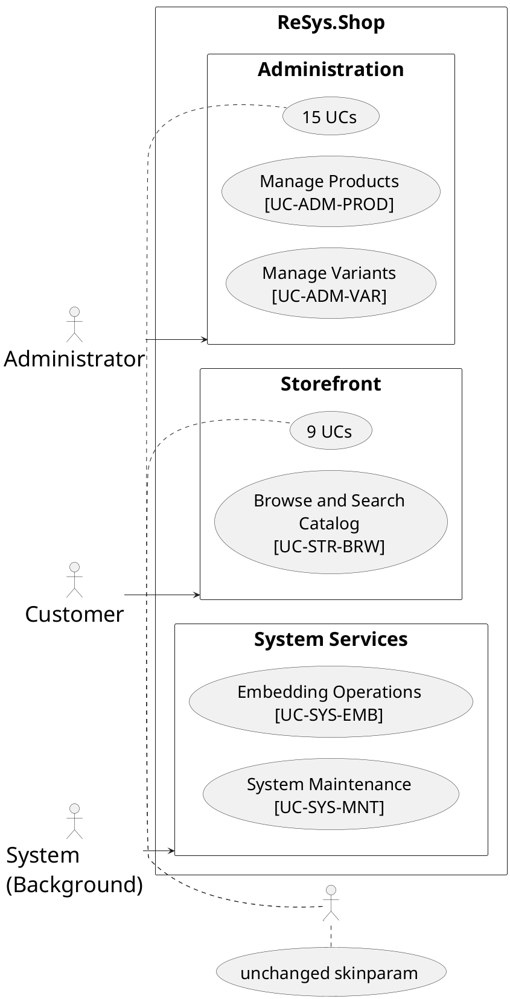

# Introduction

Fixes three issues discovered after the initial use case diagram redesign: PlantUML
skinparam warnings in the shared style file, broken overview diagram layout, and
diagram tables being placed after UC specification tables instead of before.

## 1. Purpose & Scope

Fix three build/rendering issues in the thesis use case diagram suite:

1. `_shared/styles.iuml` emits PlantUML warnings for `left to right direction` and
   `skinparam` directives inside an `@startuml/@enduml` include file
2. Overview diagram (`P2S2.2.2_use-case-overview.puml`) renders at 833×4096px —
   extreme portrait layout from 25 nested topic rectangles
3. Per-topic `#figure(image(...))` blocks in `.typ` files appear after UC
   specification tables; they should appear before

## 2. Definitions

| Term | Definition |
|------|-----------|
| Per-topic diagram | A PlantUML `.puml` file showing one use case topic expanded into sub-use cases with `<<include>>` relationships |
| Overview diagram | The single `.puml` showing all 26 UCs across 3 actor areas |
| `<style>` block | PlantUML CSS-like syntax for element styling, replacing skinparam |

## 3. Requirements, Constraints & Guidelines

- **REQ-001**: `_shared/styles.iuml` must contain ONLY `<style>...</style>` block content — no `skinparam`, no `left to right direction`
- **REQ-002**: Each per-topic `.puml` must declare `left to right direction` and any layout skinparam BEFORE the `!include _shared/styles.iuml` line
- **REQ-003**: Overview diagram must NOT use nested topic rectangles — UC ellipses go directly inside the 3 area rectangles
- **REQ-004**: Overview diagram must keep actor→area associations (3 lines)
- **REQ-005**: Per-topic `#figure(image(...))` blocks must appear BEFORE `#figure(table(...))` blocks in every `.typ` file
- **REQ-006**: No content changes to UC specification tables or image paths
- **CON-001**: All font sizes, colors, and border styles remain unchanged from the previous design
- **GUD-001**: The overview still uses `skinparam` (not `<style>`) because it needs larger font sizes for page-width readability

## 4. Interfaces & Data Contracts

### `_shared/styles.iuml` (after fix)

Only a `<style>` block wrapped in `@startuml/@enduml`. No directives outside:

```plantuml
@startuml

' ReSys.Shop Use Case Style (Academic Grayscale Theme)

<style>
  root {
    fontName "Arial"
    fontSize 14
    shadowing false
  }
  actor {
    backgroundColor #FFFFFF
    borderColor #000000
    borderThickness 1.5
    fontColor #000000
    fontStyle bold
    fontSize 16
  }
  usecase {
    backgroundColor #FFFFFF
    borderColor #000000
    borderThickness 1.5
    fontColor #000000
  }
  rectangle {
    backgroundColor #FFFFFF
    borderColor #000000
    borderThickness 1.5
    fontStyle bold
  }
  arrow {
    lineColor #000000
    lineThickness 1.5
    fontSize 12
  }
</style>

@enduml
```

### Per-topic `.puml` template (after fix)

Layout directives go before the include:

```plantuml
@startuml usecase-{slug}

left to right direction
skinparam padding 8
skinparam nodesep 40
skinparam ranksep 40

!include _shared/styles.iuml
title {UC-ID}: {Use Case Name}

actor "{Actor}" as ActorA

rectangle "{Topic Heading}" {
  usecase "{UC Name}\n[{UC-ID}]" as UC_MAIN
  usecase "{SubName}" as UC_SUB_1
  UC_MAIN ..> UC_SUB_1 : <<include>>
}

ActorA --> UC_MAIN

@enduml
```

### Overview diagram layout (after fix)

UC ellipses directly under each area — no topic rectangles:



### `.typ` insertion order (after fix)

Diagram image block BEFORE the UC heading and table:

```typst
// Diagram placeholder: Product Management

#figure(
  image(
    "../../../../../figures/chapters/part2/ch2-design/02-use-cases/diagrams/P2S2.2.2_usecase-product-management.png",
    width: 100%
  ),
  caption: [Use case diagram for Product Management (UC-ADM-PROD).],
) <fig-uc-adm-prod-d>

==== UC-ADM-PROD — Manage Products

#figure(
  table( ... ),
  caption: [Manage Products.],
)
```

## 5. Acceptance Criteria

- **AC-001**: Given `make plantuml`, when building all per-topic `.puml` files, then zero warnings emitted about skinparam or direction directives
- **AC-002**: Given the overview `.puml` is built, when checking output PNG dimensions, then width is at least 1200px and height is at most 3000px
- **AC-003**: Given any per-topic `.typ` file, when locating `#figure(image(...))` blocks, then they appear before their corresponding `==== UC-XXXX` heading
- **AC-004**: Given `typst compile main.typ`, when the document compiles, then zero errors are reported
- **AC-005**: All existing UC specification table content is unchanged after the fix

## 6. Test Automation Strategy

- **Verification command**: `make plantuml 2>&1 | grep -i warn; typst compile main.typ /tmp/verify-fix.pdf`
- **Path check**: `grep -rn 'figures/chapters' chapters/part2/ch2-design/02-use-cases/ | grep -v '/diagrams/' | grep -v '^[[:space:]]*//'` — must return zero matches
- **Overview dimensions**: `identify figures/.../P2S2.2.2_use-case-overview.png`

## 7. Rationale & Context

**Pure CSS styles:** Skinparam directives inside an `!include`d `@startuml/@enduml` file
produce warnings from PlantUML's preprocessor. The `<style>` block handles all visual
styling; layout directives (`left to right direction`, `padding`, `nodesep`, `ranksep`)
belong in each diagram file directly, before the include.

**Overview layout:** The 25 nested topic rectangles forced PlantUML into extreme portrait
(833×4096px). Removing the intermediate nesting layer (topic rectangles within area
rectangles) lets PlantUML arrange UC ellipses in an efficient grid within each area.
The topic grouping detail belongs in the per-topic diagrams, not the overview.

**Diagram before table:** Readers should see the diagram first (visual summary) then the
detailed tabular specification. This order matches standard thesis figure placement
conventions.

## 8. Files Changed

| File | Action | Count |
|------|--------|-------|
| `_shared/styles.iuml` | Rewrite — `<style>` only | 1 |
| `P2S2.2.2_usecase-*.puml` | Add layout directives before `!include` | 25 |
| `P2S2.2.2_use-case-overview.puml` | Rewrite — remove topic rectangles | 1 |
| `.typ` chapter files | Move `#figure(image(...))` above UC heading | 25 |

## 9. Examples & Edge Cases

**Edge case**: CRUD-style per-topic diagrams (no sub-use cases). These have no `<<include>>`
lines. The template still applies — add layout directives before `!include`, same pattern.
The diagram is just: rectangle, one UC ellipse, actor connection.

**Edge case**: Per-topic diagrams with supporting actors (ML Service, Payment Gateway).
Layout directives go before `!include` as usual. Supporting actor connections remain
unchanged.

**Edge case**: Overview has 3 areas but only 3 actor lines. With UCs directly inside
areas (no topic rectangles), PlantUML auto-arranges UCs in a grid. The `Admin->AdmArea`
association is sufficient — the diagram doesn't need individual actor→UC lines.

## 10. Validation Criteria

- `make plantuml` produces no warnings containing "skinparam" or "direction"
- `identify .../P2S2.2.2_use-case-overview.png` returns width ≥ 1200, height ≤ 3000
- Every `.typ` file has `image(...)` before `==== UC-` for all topic headings
- `typst compile main.typ` succeeds with zero errors
- All 25 per-topic `.puml` files have `left to right direction` before `!include`

## 11. Related Specifications / Further Reading

- `docs/superpowers/specs/2026-07-27-use-case-diagram-redesign.md` — parent spec
- `docs/superpowers/plans/2026-07-27-use-case-diagram-redesign.md` — implementation plan
